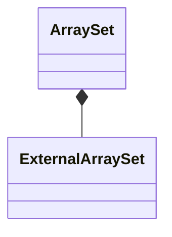

# ArraySet

`ArraySet` is a `final` class template
defined in [`Fw/DataStructures`](sdd.md).
It represents an array-based set with internal storage.

## 1. Template Parameters

`ArraySet` has the following template parameters.

|Kind|Name|Purpose|
|----|----|-------|
|`typename`|`T`|The type of an element in the set|
|`FwSizeType`|`C`|The capacity, i.e., the maximum number of elements that the set can store|

`ArraySet` statically asserts that `C > 0`.

## 2. Base Class

`ArraySet` is publicly derived from
[`SetBase<T>`](SetBase.md).

<a name="Public-Types"></a>
## 3. Public Types

`ArraySet` defines the following public types:

|Name|Definition|
|----|----------|
|`ConstIterator`|Alias of [`SetConstIterator<T>`](SetConstIterator.md)|
|`Entry`|Alias of [`SetOrMapImplEntry<T, Nil>`](SetOrMapImplEntry.md)|

The type `Nil` is defined [in this file](Nil.md).

## 4. Private Member Variables

`ArraySet` has the following private member variables.

|Name|Type|Purpose|Default Value|
|----|----|-------|-------------|
|`m_extSet`|[`ExternalArraySet<T>`](ExternalArraySet.md)|The external set implementation|C++ default initialization|
|`m_entries`|`Entry[C]`|The array providing the backing memory for `m_extSet`|C++ default initialization|

The type `Entry` is defined [in this section](ArraySet.md#Public-Types).



## 5. Public Constructors and Destructors

### 5.1. Zero-Argument Constructor

```c++
ArraySet()
```

Initialize `m_extSet` with `ExternalArraySet<T>(m_entries, C)`.

_Example:_
```c++
ArraySet<U32, 10> set;
```

### 5.2. Copy Constructor

```c++
ArraySet(const ArraySet<T, C>& set)
```

1. Initialize `m_extSet` with `ExternalArraySet<T>(m_entries, C)`.

2. Set `*this = set`.

_Example:_
```c++
using Set = ArraySet<U32, 10>;
Set s1;
// Insert an item
const U32 element = 42;
const auto status = s1.insert(element);
ASSERT_EQ(status, Success::SUCCESS);
// Call the copy constructor
Set s2;
ASSERT_EQ(s2.getSize(), 1);
```

### 5.3. Destructor

```c++
~ArraySet() override
```

Defined as `= default`.

## 6. Public Member Functions

### 6.1. operator=

```c++
ArraySet<T, C>& operator=(const ArraySet<T, C>& set)
```

Return `m_extSet.copyDataFrom(set)`.

_Example:_
```c++
using Set = ArraySet<U32, 10>;
Set s1;
// Insert an item
U32 element = 42;
const auto status = s1.insert(element);
ASSERT_EQ(status, Success::SUCCESS);
// Call the default constructor
Set s2;
ASSERT_EQ(s2.getSize(), 0);
// Call the copy assignment operator
s2 = s1;
ASSERT_EQ(s2.getSize(), 1);
status = s2.find(element);
ASSERT_EQ(status, Success::SUCCESS);
```

### 6.2. begin

```c++
ConstIterator begin() const
```

Return `m_extSet.begin()`.

_Example:_
```c++
using Set = ArraySet<U32, 10>;
Set set;
// Insert an element in the set
const auto status = map.insert(42);
ASSERT_EQ(status, Fw::Success::SUCCESS);
// Get a set const iterator object
auto it = set.begin();
// Use the iterator to access the underlying map const entry
ASSERT_EQ(*it, 42);
```

### 6.3. clear

```c++
void clear() override
```

Call `m_extSet.clear()`.

_Example:_
```c++
using Set = ArraySet<U32, 10>;
Set set;
const auto status = set.insert(42);
ASSERT_EQ(set.getSize(), 1);
set.clear();
ASSERT_EQ(set.getSize(), 0);
```

### 6.4. end

```c++
ConstIterator end() const
```

Return `m_extSet.end()`.

_Example:_
```c++
using Set = ArraySet<U32, 10>;
// Call the constructor providing backing storage
Set set;
// Insert an element in the set
auto status = set.insert(42);
ASSERT_EQ(status, Fw::Success::SUCCESS);
// Get a set const iterator object
auto iter = set.begin();
// Check that iter is not at the end
ASSERT_NE(iter, set.end());
// Increment iter
it++;
// Check that iter is at the end
ASSERT_EQ(iter, set.end());
```

### 6.5. find

```c++
Success find(const K& element, V& value) override
```

Return `m_extSet.find(element)`.

_Example:_
```c++
using Set = ArraySet<U32, 10>;
Set set;
auto status = set.find(42);
ASSERT_EQ(status, Success::FAILURE);
status = set.insert(42);
ASSERT_EQ(status, Success::SUCCESS);
status = set.find(42);
ASSERT_EQ(status, Success::SUCCESS);
```

### 6.6. getCapacity

```c++
FwSizeType getCapacity() const override
```

Return `m_extSet.getCapacity()`.

_Example:_
```c++
using Set = ArraySet<U32, 10>;
Set set;
ASSERT_EQ(set.getCapacity(), 10);
```

### 6.7. getSize

```c++
FwSizeType getSize() const override
```

Return `m_extSet.getSize()`.

_Example:_
```c++
using Set = ArraySet<U32, 10>;
Set set;
auto size = set.getSize();
ASSERT_EQ(size, 0);
const auto status = set.insert(42);
ASSERT_EQ(status, Success::SUCCESS);
size = set.getSize();
ASSERT_EQ(size, 1);
```

### 6.8. insert

```c++
Success insert(const T& element) override
```

Return `m_extSet.insert(element)`.

_Example:_
```c++
using Set = ArraySet<U32, 10>;
Set set;
auto size = set.getSize();
ASSERT_EQ(size, 0);
const auto status = set.insert(42);
ASSERT_EQ(status, Success::SUCCESS);
size = set.getSize();
ASSERT_EQ(size, 1);
```

### 6.9. remove

```c++
Success remove(const T& element) override
```

Return `m_extSet.remove(element)`.

_Example:_
```c++
using Set = ArraySet<U32, 10>;
Set set;
auto size = set.getSize();
ASSERT_EQ(size, 0);
auto status = set.insert(42);
ASSERT_EQ(status, Success::SUCCESS);
size = set.getSize();
ASSERT_EQ(size, 1);
// Element does not exist
status = set.remove(0);
ASSERT_EQ(status, Success::FAILURE);
ASSERT_EQ(size, 1);
// Element exists
status = set.remove(42);
ASSERT_EQ(status, Success::SUCCESS);
ASSERT_EQ(size, 0);
```
