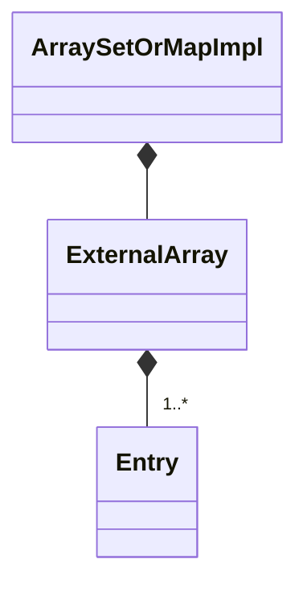

# ArraySetOrMapImpl

`ArraySetOrMapImpl` is a `final` class template
defined in [`Fw/DataStructures`](sdd.md).
It represents an array-based implementation of a set or map.
Internally it maintains an [`ExternalArray`](ExternalArray.md) for
storing the entries in the set or map.

## 1. Template Parameters

`ArraySetOrMapImpl` has the following template parameters.

|Kind|Name|Purpose|
|----|----|-------|
|`typename`|`KE`|The type of a key in a map or the element of a set|
|`typename`|`VN`|The type of a value in a map or Nil for set|

<a name="Public-Types"></a>
## 2. Public Types

<a name="Public-Type-Aliases"></a>
### 2.1. Type Aliases

`ArraySetOrMapImpl` defines the following type aliases:

|Name|Definition|
|----|----------|
|`Entry`|Alias for [`SetOrMapImplEntry<KE, VN>`](SetOrMapImplEntry.md)|

### 2.2. ConstIterator

`ConstIterator` is a public inner class of `ArraySetOrMapImpl`.
It provides non-modifying iteration over the elements of an `ArraySetOrMapImpl`
instance.
It is a base class of [`SetOrMapImplConstIterator<KE, 
VN>`](SetOrMapImplConstIterator.md).

## 3. Private Member Variables

`ArraySetOrMapImpl` has the following private member variables.

|Name|Type|Purpose|Default Value|
|----|----|-------|-------------|
|`m_entries`|[`ExternalArray<Entry>`](ExternalArray.md)|The array for storing the set or map entries|C++ default initialization|
|`m_size`|`FwSizeType`|The number of entries in the set or map|0|



## 4. Public Constructors and Destructors

### 4.1. Zero-Argument Constructor

```c++
ArraySetOrMapImpl()
```

Initialize each member variable with its default value.

### 4.2. Constructor Providing Typed Backing Storage

```c++
ArraySetOrMapImpl(Entry* entries, FwSizeType capacity)
```

Call `setStorage(entries, capacity)`.

### 4.3. Constructor Providing Untyped Backing Storage

```c++
ArraySetOrMapImpl(ByteArray data, FwSizeType capacity)
```

`data` must be aligned according to
[`getByteArrayAlignment()`](#getByteArrayAlignment) and must
contain at least [`getByteArraySize(size)`](#getByteArraySize) bytes.

Call `setStorage(data, capacity)`.

### 4.4. Copy Constructor

```c++
ArraySetOrMapImpl(const ArraySetOrMapImpl<KE, VN>& map)
```

Set `*this = map`.

### 4.5. Destructor

```c++
~ArraySetOrMapImpl()
```

Defined as `= default`.

## 5. Public Member Functions

### 5.1. operator=

```c++
ArraySetOrMapImpl<KE, VN>& operator=(const ArraySetOrMapImpl<KE, VN>& impl)
```

1. If `&impl != this`

    1. Set `m_entries = impl.m_entries`.

    1. Set `m_size = impl.m_size`.

1. Return `*this`.

### 5.2. begin

```c++
ConstIterator begin() const
```

Return `ConstIterator(*this)`.

### 5.3. clear

```c++
void clear()
```

Set `m_size = 0`.

### 5.4. end

```c++
ConstIterator end() const
```

1. Set `it = begin()`.

1. Call `it.setToEnd()`.

1. Return `it`.

### 5.5. find

```c++
Success find(const KE& keyOrElement, VN& valueOrNil) const
```

1. Set `status = Success::FAILURE`.

1. For `i` in `[0, m_size)`

    1. Let `const auto& e = m_entries[i]`.

    1. If `e.getKey() == keyOrElement`

        1. Set `valueOrNil = e.getValue()`.

        1. Set `status = Success::SUCCESS`.

        1. Break out of the loop.

1. Return `status`.

### 5.6. getCapacity

```c++
FwSizeType getCapacity() const
```

Return `m_entries.getSize()`.

### 5.8. getSize

```c++
FwSizeType getSize()
```

Return `m_size`.

### 5.9. insert

```c++
Success insert(const KE& keyOrElement, const VN& valueOrNil)
```

1. Set `status = Success::FAILURE`.

1. For `i` in `[0, m_size)`

    1. Let `auto& e = m_entries[i]`.

    1. If `e.getKey() == keyOrElement`

        1. Call `e.setValue(valueOrNil)`.

        1. Set `status = Success::SUCCESS`.

        1. Break out of the loop

1. If `(status == Success::FAILURE) && (m_size < getCapacity())`

    1. Set `m_entries[m_size] = Entry(keyOrElement, valueOrNil)`.

    1. If `m_size > 0` then
       call `m_entries[m_size - 1].setNextEntry(&m_entries[m_size])`.

    1. Increment `m_size`.

    1. Set `status = Success::SUCCESS`.

1. Return `status`.

### 5.10. remove

```c++
Success remove(const KE& keyOrElement, VN& valueOrNil)
```

1. Set `status = Success::FAILURE`.

1. For `i` in `[0, m_size)`

    1. If `m_entries[i].getKey() == keyOrElement`

        1. Set `valueOrNil = m_entries[i].getValue()`.

        1. If `i < m_size - 1` then

            1. `m_entries[i] = m_entries[m_size - 1]`.

            1. Call `m_entries[i].setNextEntry(&m_entries[i + 1])`.

        1. Otherwise call `m_entries[i].setNextEntry(nullptr)`.

        1. Decrement `size`.

        1. Set `status = Success::SUCCESS`.

        1. Break out of the loop.

1. Return `status`.

### 5.11. setStorage (Typed Data)

```c++
void setStorage(Entry* entries, FwSizeType capacity)
```

1. Call `m_entries.setStorage(entries, capacity)`.

1. Call `clear()`.

### 5.12. setStorage (Untyped Data)

```c++
void setStorage(ByteArray data, FwSizeType capacity)
```

`data` must be aligned according to
[`getByteArrayAlignment()`](#getByteArrayAlignment) and must
contain at least [`getByteArraySize(size)`](#getByteArraySize) bytes.

1. Call `m_entries.setStorage(data, capacity)`.

1. Call `clear()`.

## 6. Public Static Functions

<a name="getByteArrayAlignment"></a>
### 6.1. getByteArrayAlignment

```c++
static constexpr U8 getByteArrayAlignment()
```

Return `ExternalArray<Entry>::getByteArrayAlignment()`.

<a name="getByteArraySize"></a>
### 6.2. getByteArraySize

```c++
static constexpr FwSizeType getByteArraySize(FwSizeType capacity)
```

Return `ExternalArray<Entry>::getByteArraySize(capacity)`.
