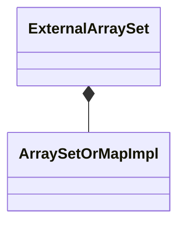

# ExternalArraySet

`ExternalArraySet` is a `final` class template
defined in [`Fw/DataStructures`](sdd.md).
It represents an array-based set with external storage.
Internally it maintains an [`ArraySetOrMapImpl`](ArraySetOrMapImpl.md)
as the set implementation.

## 1. Template Parameters

`ExternalArraySet` has the following template parameters.

|Kind|Name|Purpose|
|----|----|-------|
|`typename`|`T`|The type of an element in the set|

## 2. Base Class

`ExternalArraySet` is publicly derived from
[`SetBase<T>`](SetBase.md).

<a name="Public-Types"></a>
## 3. Public Types

`ExternalArraySet` defines the following public types:

|Name|Definition|
|----|----------|
|`ConstIterator`|Alias of [`MapConstIterator<T>`](MapConstIterator.md)|
|`Entry`|Alias of [`SetOrMapImplEntry<T, Nil>`](SetOrMapImplEntry.md)|

The type `Nil` is defined [in this file](Nil.md).

## 4. Private Member Variables

`ExternalArraySet` has the following private member variables.

|Name|Type|Purpose|Default Value|
|----|----|-------|-------------|
|`m_impl`|[`ArraySetOrMapImpl<T, Nil>`](ArraySetOrMapImpl.md)|The set implementation|C++ default initialization|

The type `Nil` is defined [in this file](Nil.md).



## 5. Public Constructors and Destructors

### 5.1. Zero-Argument Constructor

```c++
ExternalArraySet()
```

Initialize each member variable with its default value.

_Example:_
```c++
ExternalArraySet<U32> set;
```

### 5.2. Constructor Providing Typed Backing Storage

```c++
ExternalArraySet(Entry* entries, FwSizeType capacity)
```

`entries` must point to a primitive array of at least `capacity`
elements of type `Entry`.
The type `Entry` is defined [in this section](ExternalArraySet.md#Public-Types).

Call `setStorage(entries, capacity)`.

_Example:_
```c++
using Set = ExternalArraySet<U32>;
constexpr FwSizeType capacity = 10;
Set::Entry entries[capacity];
Set set(entries, capacity);
```

### 5.3. Constructor Providing Untyped Backing Storage

```c++
ExternalArraySet(ByteArray data, FwSizeType capacity)
```

`data` must be aligned according to 
[`getByteArrayAlignment()`](#getByteArrayAlignment) and must
contain at least [`getByteArraySize(capacity)`](#getByteArraySize) bytes.

Call `setStorage(data, capacity)`.

_Example:_
```c++
using Set = ExternalArraySet<U32>;
constexpr FwSizeType capacity = 10;
constexpr U8 alignment = Set::getByteArrayAlignment();
constexpr FwSizeType byteArraySize = Set::getByteArraySize(capacity);
alignas(alignment) U8 bytes[byteArraySize];
ExternalArraySet<U32> set(ByteArray(&bytes[0], sizeof bytes), capacity);
```

### 5.4. Copy Constructor

```c++
ExternalArraySet(const ExternalArraySet<T>& set)
```

Set `*this = set`.

_Example:_
```c++
using Set = ExternalArraySet<U32>;
constexpr FwSizeType capacity = 3;
Set::Entry entries[capacity];
// Call the constructor providing backing storage
Set m1(entries, capacity);
// Insert an item
const auto status = m1.insert(42);
ASSERT_EQ(status, Success::SUCCESS);
// Call the copy constructor
Set m2(m1);
ASSERT_EQ(m2.getSize(), 1);
```

### 5.5. Destructor

```c++
~ExternalArraySet() override
```

Defined as `= default`.

## 6. Public Member Functions

### 6.1. operator=

```c++
ExternalArraySet<T>& operator=(const ExternalArraySet<T>& set)
```

1. If `&set != this`

    1. Set `m_impl = set.m_impl`.

1. Return `*this`.

_Example:_
```c++
using Set = ExternalArraySet<U32>;
constexpr FwSizeType capacity = 3;
Set::Entry entries[capacity];
// Call the constructor providing backing storage
Set m1(entries, capacity);
// Insert an item
const auto status = m1.insert(42);
ASSERT_EQ(status, Success::SUCCESS);
// Call the default constructor
Set m2;
ASSERT_EQ(m2.getSize(), 0);
// Call the copy assignment operator
m2 = m1;
ASSERT_EQ(m2.getSize(), 1);
```

### 6.2. begin

```c++
ConstIterator begin() const
```

Return `m_impl.begin()`.

_Example:_
```c++
using Set = ExternalArraySet<U32>;
constexpr FwSizeType capacity = 10;
Set::Entry entries[capacity];
// Call the constructor providing backing storage
Set set(entries, capacity);
// Insert an entry in the set
const auto status = set.insert(42);
ASSERT_EQ(status, Fw::Success::SUCCESS);
// Get a set const iterator object
auto it = set.begin();
// Use the iterator to access the element
ASSERT_EQ(*it, 42);
```

### 6.3. clear

```c++
void clear() override
```

Call `m_impl.clear()`.

_Example:_
```c++
using Set = ExternalArraySet<U32>;
constexpr FwSizeType capacity = 10;
Set::Entry entries[capacity];
Set set(entries, capacity);
const auto status = set.insert(42);
ASSERT_EQ(set.getSize(), 1);
set.clear();
ASSERT_EQ(set.getSize(), 0);
```

### 6.4. end

```c++
ConstIterator end() const
```

Return `m_impl.end()`.

_Example:_
```c++
using Set = ExternalArraySet<U32>;
constexpr FwSizeType capacity = 10;
Set::Entry entries[capacity];
// Call the constructor providing backing storage
Set set(entries, capacity);
// Insert an entry in the set
auto status = set.insert(42);
ASSERT_EQ(status, Fw::Success::SUCCESS);
// Get a set const iterator object
auto iter = set.begin();
// Check that iter is not at the end
ASSERT_NE(iter, set.end());
// Increment iter
it++;
// Check that iter is at the end
ASSERT_EQ(iter, set.end());
```

### 6.5. find

```c++
Success find(const T& element) override
```

1. Set `Nil nil = {}`.

1. Return `m_impl.find(key, nil)`.

_Example:_
```c++
using Set = ExternalArraySet<U32>;
constexpr FwSizeType capacity = 10;
Set::Entry entries[capacity];
Set set(entries, capacity);
auto status = set.find(42);
ASSERT_EQ(status, Success::FAILURE);
status = set.insert(42);
ASSERT_EQ(status, Success::SUCCESS);
status = set.find(42);
ASSERT_EQ(status, Success::SUCCESS);
```

### 6.6. getCapacity

```c++
FwSizeType getCapacity() const override
```

Return `m_impl.getCapacity()`.

_Example:_
```c++
using Set = ExternalArraySet<U32>;
constexpr FwSizeType capacity = 10;
Set::Entry entries[capacity];
Set set(entries, capacity);
ASSERT_EQ(set.getCapacity(), capacity);
```

### 6.8. getSize

```c++
FwSizeType getSize() const override
```

Return `m_impl.getSize()`.

_Example:_
```c++
using Set = ExternalArraySet<U32>;
constexpr FwSizeType capacity = 10;
Set::Entry entries[capacity];
Set set(entries, capacity);
auto size = set.getSize();
ASSERT_EQ(size, 0);
const auto status = set.insert(42);
ASSERT_EQ(status, Success::SUCCESS);
size = set.getSize();
ASSERT_EQ(size, 1);
```

### 6.9. insert

```c++
Success insert(const T& element) override
```

Return `m_impl.insert(key, Nil())`.

_Example:_
```c++
using Set = ExternalArraySet<U32>;
constexpr FwSizeType capacity = 10;
Set::Entry entries[capacity];
Set set(entries, capacity);
auto size = set.getSize();
ASSERT_EQ(size, 0);
const auto status = set.insert(42);
ASSERT_EQ(status, Success::SUCCESS);
size = set.getSize();
ASSERT_EQ(size, 1);
```

### 6.10. remove

```c++
Success remove(const T& element) override
```

1. Set `Nil nil = {}`.

1. Return `m_impl.remove(key, nil)`.

_Example:_
```c++
using Set = ExternalArraySet<U32>;
constexpr FwSizeType capacity = 10;
Set::Entry entries[capacity];
Set set(entries, capacity);
auto size = set.getSize();
ASSERT_EQ(size, 0);
auto status = set.insert(42);
ASSERT_EQ(status, Success::SUCCESS);
size = set.getSize();
ASSERT_EQ(size, 1);
// Element does not exist
status = set.remove(0);
ASSERT_EQ(status, Success::FAILURE);
ASSERT_EQ(size, 1);
// Element exists
status = set.remove(42);
ASSERT_EQ(status, Success::SUCCESS);
ASSERT_EQ(size, 0);
```

### 6.11. setStorage (Typed Data)

```c++
void setStorage(Entry* entries, FwSizeType capacity)
```

`entries` must point to a primitive array of at least `capacity`
elements of type `Entry`.
The type `Entry` is defined [in this section](ExternalArraySet.md#Public-Types).

Call `m_impl.setStorage(entries, capacity)`.

_Example:_
```c++
using Set = ExternalArraySet<U32>;
constexpr FwSizeType capacity = 10;
Set set;
Set::Entry entries[capacity];
set.setStorage(entries, capacity);
```

### 6.12. setStorage (Untyped Data)

```c++
void setStorage(ByteArray data, FwSizeType capacity)
```

`data` must be aligned according to 
[`getByteArrayAlignment()`](#getByteArrayAlignment) and must
contain at least [`getByteArraySize(capacity)`](#getByteArraySize) bytes.

1. Call `m_entries.setStorage(data, capacity)`.

1. Call `clear()`.

```c++
using Set = ExternalArraySet<U32>;
constexpr FwSizeType capacity = 10;
constexpr U8 alignment = Set::getByteArrayAlignment();
constexpr FwSizeType byteArraySize = Set::getByteArraySize(capacity);
alignas(alignment) U8 bytes[byteArraySize];
Set set;
set.setStorage(ByteArray(&bytes[0], sizeof bytes), capacity);
```

## 7. Public Static Functions

<a name="getByteArrayAlignment"></a>
### 7.1. getByteArrayAlignment

```c++
static constexpr U8 getByteArrayAlignment()
```

Return `ArraySetOrMapImpl<Entry>::getByteArrayAlignment()`.

<a name="getByteArraySize"></a>
### 7.2. getByteArraySize

```c++
static constexpr FwSizeType getByteArraySize(FwSizeType capacity)
```

Return `ArraySetOrMapImpl<Entry>::getByteArraySize(capacity)`.
