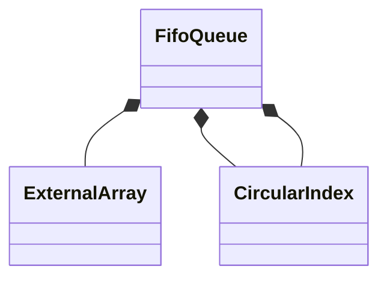

# ExternalFifoQueue

`ExternalFifoQueue` is a `final` class template
defined in [`Fw/DataStructures`](sdd.md).
It represents a FIFO queue with external storage.
Internally it maintains an [`ExternalArray`](ExternalArray.md) for 
storing the items on the queue.

## 1. Template Parameters

`ExternalFifoQueue` has the following template parameters.

|Kind|Name|Purpose|
|----|----|-------|
|`typename`|`T`|The type of an item on the queue|

## 2. Base Class

`ExternalFifoQueue<T>` is publicly derived from 
[`FifoQueueBase<T>`](FifoQueueBase.md).

## 3. Private Member Variables

`ExternalFifoQueue` has the following private member variables.

|Name|Type|Purpose|Default Value|
|----|----|-------|-------------|
|`m_items`|[`ExternalArray<T>`](ExternalArray.md)|The array for storing the queue items|C++ default initialization|
|`m_enqueueIndex`|[`CircularIndex`](CircularIndex.md)|The enqueue index|`CircularIndex(m_items.size(), 0)`|
|`m_dequeueIndex`|[`CircularIndex`](CircularIndex.md)|The dequeue index|`CircularIndex(m_items.size(), 0)`|
|`m_size`|`FwSizeType`|The number of items on the queue|0|



## 4. Public Constructors and Destructors

### 4.1. Zero-Argument Constructor

```c++
ExternalFifoQueue()
```

Initialize each member variable with its default value.

_Example:_
```c++
ExternalFifoQueue<U32> queue;
```

### 4.2. Constructor Providing Typed Backing Storage

```c++
ExternalFifoQueue(T* items, FwSizeType capacity)
```

`items` must point to a primitive array of at least `capacity`
items of type `T`.

1. Call `setStorage(items, capacity)`.

1. Initialize the other member variables with their default values.

_Example:_
```c++
constexpr FwSizeType capacity = 10;
U32 items[capacity];
ExternalFifoQueue<U32> queue(items, capacity);
```

### 4.3. Constructor Providing Untyped Backing Storage

```c++
ExternalFifoQueue(ByteArray data, FwSizeType capacity)
```

`data` must be aligned according to 
[`getByteArrayAlignment()`](#getByteArrayAlignment) and must
contain at least [`getByteArraySize(capacity)`](#getByteArraySize) bytes.

1. Call `setStorage(data, capacity)`.

1. Initialize the other member variables with their default values.

_Example:_
```c++
constexpr FwSizeType capacity = 10;
constexpr U8 alignment = ExternalFifoQueue<U32>::getByteArrayAlignment();
constexpr FwSizeType byteArraySize = ExternalFifoQueue<U32>::getByteArraySize(capacity);
alignas(alignment) U8 bytes[byteArraySize];
ExternalFifoQueue<U32> queue(ByteArray(&bytes[0], sizeof bytes), capacity);
```

### 4.4. Copy Constructor

```c++
ExternalFifoQueue(const ExternalFifoQueue<T>& queue)
```

Set `*this = queue`.

_Example:_
```c++
constexpr FwSizeType capacity = 3;
U32 items[capacity];
// Call the constructor providing backing storage
ExternalFifoQueue<U32> q1(items, capacity);
// Enqueue an item
U32 value = 42;
(void) q1.enqueue(value);
// Call the copy constructor
ExternalFifoQueue<U32> q2(q1);
ASSERT_EQ(q2.getSize(), 1);
```

### 4.5. Destructor

```c++
~ExternalFifoQueue() override
```

Defined as `= default`.

## 5. Public Member Functions

### 5.1. operator=

```c++
ExternalFifoQueue<T>& operator=(const ExternalFifoQueue<T>& queue)
```

1. If `&queue != this`

    1. Set `m_items = queue.m_items`.

    1. Set `m_enqueueIndex = queue.m_enqueueIndex`.

    1. Set `m_dequeueIndex = queue.m_dequeueIndex`.

    1. Set `m_size = queue.m_size`.

1. Return `*this`.

_Example:_
```c++
constexpr FwSizeType capacity = 3;
U32 items[capacity];
// Call the constructor providing backing storage
ExternalFifoQueue<U32> q1(items, capacity);
// Enqueue an item
U32 value = 42;
(void) q1.enqueue(value);
// Call the default constructor
ExternalFifoQueue q2;
ASSERT_EQ(q2.getSize(), 0);
// Call the copy assignment operator
q2 = q1;
ASSERT_EQ(q2.getSize(), 1);
```

### 5.2. clear

```c++
void clear() override
```

1. Call `m_enqueueIndex.setValue(0)`.

1. Call `m_dequeueIndex.setValue(0)`.

1. Set `m_size = 0`.

_Example:_
```c++
constexpr FwSizeType capacity = 10;
U32 items[capacity];
ExternalFifoQueue<U32> queue(items, capacity);
const auto status = queue.enqueue(3);
ASSERT_EQ(queue.getSize(), 1);
queue.clear();
ASSERT_EQ(queue.getSize(), 0);
```

### 5.3. setStorage (Typed Data)

```c++
void setStorage(T* items, FwSizeType capacity)
```

`items` must point to a primitive array of at least `capacity`
items of type `T`.

1. Call `m_items.setStorage(items, capacity)`.

1. If `capacity > 0`

    1. Call `this->m_enqueueIndex.setModulus(capacity)`.

    1. Call `this->m_dequeueIndex.setModulus(capacity)`.

1. Call `this->clear()`.

_Example:_
```c++
constexpr FwSizeType capacity = 10;
ExternalFifoQueue<U32> queue;
U32 items[capacity];
queue.setStorage(items, capacity);
```

### 5.4. setStorage (Untyped Data)

```c++
void setStorage(ByteArray data, FwSizeType capacity)
```

`data` must be aligned according to 
[`getByteArrayAlignment()`](#getByteArrayAlignment) and must
contain at least [`getByteArraySize(capacity)`](#getByteArraySize) bytes.

1. Call `m_items.setStorage(data, capacity)`.

1. If `capacity > 0`

    1. Call `this->m_enqueueIndex.setModulus(capacity)`.

    1. Call `this->m_dequeueIndex.setModulus(capacity)`.

1. Call `this->clear()`.

_Example:_
```c++
constexpr FwSizeType capacity = 10;
constexpr U8 alignment = ExternalFifoQueue<U32>::getByteArrayAlignment();
constexpr FwSizeType byteArraySize = ExternalFifoQueue<U32>::getByteArraySize(capacity);
alignas(alignment) U8 bytes[byteArraySize];
ExternalFifoQueue<U32> queue;
queue.setStorage(ByteArray(&bytes[0], sizeof bytes), capacity);
```

### 5.5. enqueue

```c++
Success enqueue(const T& e) override
```

1. Set `status = Success::FAILURE`.

1. If `m_size < getCapacity()` then

    1. Set `i = m_enqueueIndex.getValue()`.

    1. Set `m_items[i] = e`.

    1. Call `m_enqueueIndex.increment()`.

    1. Increment `m_size`.

1. Return `status`.

_Example:_
```c++
constexpr FwSizeType capacity = 3;
U32 items[capacity];
ExternalFifoQueue<U32> queue(items, capacity);
ASSERT_EQ(queue.getSize(), 0);
auto status = queue.enqueue(42);
ASSERT_EQ(status, Success::SUCCESS);
ASSERT_EQ(queue.getSize(), 1);
```

### 5.6. at

```c++
const T& at(FwSizeType index) const override
```

1. Assert `index < m_size`.

1. Set `ci = m_dequeueIndex`.

1. Set `i = ci.increment(index)`.

1. Return `m_items[i]`.

_Example:_
```c++
constexpr FwSizeType capacity = 3;
U32 items[capacity];
ExternalFifoQueue<U32> queue(items, capacity);
const auto status = queue.enqueue(3);
ASSERT_EQ(status, Success::SUCCESS);
ASSERT_EQ(queue.at(0), 3);
ASSERT_DEATH(queue.at(1), "Assert");
```

### 5.7. dequeue

```c++
Success dequeue(T& e) override
```

1. Set `status = Success::FAILURE`.

1. If `m_size > 0` then

    1. Set `i = m_dequeueIndex.getValue()`.

    1. Set `e = m_items[i]`.

    1. Call `m_dequeueIndex.increment()`.

    1. Decrement `m_size`.

1. Return `status`.

_Example:_
```c++
constexpr FwSizeType capacity = 3;
U32 items[capacity];
ExternalFifoQueue<U32> queue(items, capacity);
U32 val;
auto status = queue.dequeue(val);
ASSERT_EQ(status, Success::FAILURE);
status = queue.enqueue(42);
ASSERT_EQ(status, Success::SUCCESS);
status = queue.dequeue(val);
ASSERT_EQ(status, Success::SUCCESS);
ASSERT_EQ(val, 42);
```

### 5.8. getSize

```c++
FwSizeType getSize() const override
```

Return `m_size`.

_Example:_
```c++
constexpr FwSizeType capacity = 10;
U32 items[capacity];
ExternalFifoQueue<U32> queue(items, capacity);
auto size = queue.getSize();
ASSERT_EQ(size, 0);
const auto status = queue.enqueue(3);
ASSERT_EQ(status, Success::SUCCESS);
size = queue.getSize();
ASSERT_EQ(size, 1);
```

### 5.9. getCapacity

```c++
FwSizeType getCapacity() const override
```

Return `m_items.getSize()`.

_Example:_
```c++
constexpr FwSizeType capacity = 10;
U32 items[capacity];
ExternalFifoQueue<U32> queue(items, capacity);
ASSERT_EQ(queue.getCapacity(), capacity);
```

## 6. Public Static Functions

<a name="getByteArrayAlignment"></a>
### 6.1. getByteArrayAlignment

```c++
static constexpr U8 getByteArrayAlignment()
```

Return `ExternalArray<T>::getByteArrayAlignment()`.

<a name="getByteArraySize"></a>
### 6.2. getByteArraySize

```c++
static constexpr FwSizeType getByteArraySize(FwSizeType capacity)
```

Return `ExternalArray<T>::getByteArraySize(capacity)`.
