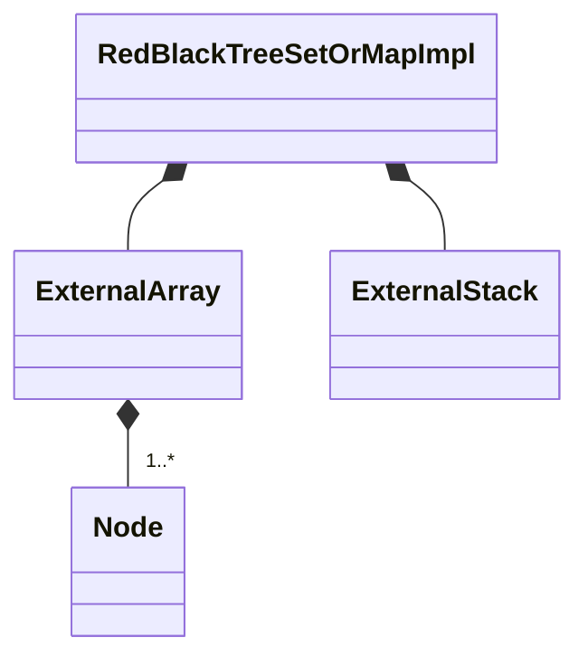

# RedBlackTreeSetOrMapImpl

`RedBlackTreeSetOrMapImpl` is a `final` class template
defined in [`Fw/DataStructures`](sdd.md).
It represents a set or map implementation based on a red-black tree.
Internally it maintains an [`ExternalArray`](ExternalArray.md)
of tree nodes and an [`ExternalStack`](ExternalStack.md) of
indices pointing into the array.
The implementation uses the algorithm described here:
https://en.wikipedia.org/wiki/Red%E2%80%93black_tree.

## 1. Red-Black Trees

A red-black tree is a binary search tree (BST) _T_ together with
a **red-black coloring**, i.e., an assignment of a color (red or
black) to each node of _T_.
A red-black tree _T_ is **valid** if it satisfies certain
validity constraints, which we state below.
The validity constraints ensure that the tree is **balanced**,
i.e., that no path from the root
of the tree to a leaf is too much longer than any of
the other paths.
Therefore the validity constraints ensure that search in the BST is fast
(order log _n_).

### 1.1. Binary Trees

A **binary tree** _T_ is a data structure defined as
follows:

1. _T_ has a set _S_ of **nodes**.

1. If _S_ is nonempty, then

    1. There is one node _R_ called the **root** of _T_.

    1. For each node _N_

        1. There may be zero, one, or two nodes designated as
           the **children** of _N_.

        1. Each child of _N_ is designated the **left** or **right** child of _N_.
           If N has two children, then there is exactly one left
           child and one right child.

    1. Each node except _R_ is the child of exactly one node.
       (Equivalently, each node except _R_ has exactly one parent.)

    1. _R_ is not the child of any node.
       (Equivalently, _R_ has no parent.)

    1. No path that starts at a node and follows child links
       contains a cycle.

Here is an example of a binary tree:

<center>
<div>

</div>
</center>

In this diagram we adopt the following conventions, which we will use
throughout this document:

1. The ovals are the nodes of the tree.

1. A solid arrow denotes a parent-child relationship between nodes.
   Each arrow goes from parent to child.

1. The left child of a node _N_, if it exists, is drawn to the left of and
   below _N_.
   The right child of _N_, if it exists, is drawn to the right and below.

Let _T_ be a binary tree, and let _N_ be a node of _T_.
We say that _N_ is a **leaf** node of _T_ if _N_
has no children.
For example, the tree shown above has a root, two leaves,
and no other nodes.

### 1.2. Binary Search Trees

A **binary search tree** (BST) is a binary tree _T_ with the following
additional properties:

1. Each node _N_ of _T_ stores a **key** _K_.
All the keys are values of the same totally-ordered type,
e.g., integers, strings, etc.

1. Each node _N_ of _T_ satisfies the following properties:

    1. If _N_ has a left child _LC_, then any key stored in
       _LC_ or in any node reachable by following child links from
       _LC_ compares less than the key stored in _N_.

    1. If _N_ has a right child _RC_, then the key stored in
       _RC_ or in any node reachable by following child links from
       _RC_ compares greater than the key stored in _N_.

Here is an example of a BST:

<center>
<div>

</div>
</center>

In this diagram we adopt the following conventions, which we will use
throughout this document:

1. The labels in the nodes are symbolic names for the keys stored in the nodes.

1. A lexically prior name stores a prior key.
   For example, we could have K1 = 1, K2 = 2, K3 = 3; or K1 = `"a"`, K2 =
   `"b"`, K3 = `"c"`; etc.

<a name="red-black-colorings"></a>
### 1.3. Red-Black Colorings

A **red-black tree** is a BST _T_ together with a **red-black coloring**,
i.e., an assignment of a color (red or black) to each node of _T_.
For example, here is a red-black tree:

<center>
<div>

</div>
</center>

The color of a node in the diagram is its color in the
red-black coloring.

Certain red-black trees are considered **valid**.
In the rest of this section, we define the validity constraints.
The standard BST insert and remove operations can violate the
validity constraints.
Therefore, when inserting or removing a node, we must perform
a **rebalancing**, i.e., a transformation that rearranges
links and recolors nodes to maintain
the BST property and to produce a valid coloring.

<a name="leaf-augmented-trees"></a>
#### 1.3.1. Leaf-Augmented Trees

In order to state the validity constraints for a red-black tree,
we need to define the concept of a **leaf-augmented tree**.
Let _T_ be a red-black tree.
We define the leaf-augmented tree _T'_ corresponding to _T_
as follows:

1.  If _T_ is empty, then _T'_ consists of a single black node.

1.  Otherwise, _T'_ is the red-black colored binary tree
   that results from (1) adding a new black
   leaf node as a left child of every node of _T_ that has no left child
   and (2) adding a new black leaf node as a right child of every node of _T_
   that has no right child.

For example, here is the leaf-augmented tree corresponding to
the tree shown above:

<center>
<div>

</div>
</center>

Notice that a leaf-augmented tree has the following properties:

1. Every leaf node is black.

2. Every node either is a leaf node or has exactly two children.

<a name="valid-colorings"></a>
#### 1.3.2. Valid Colorings

A red-black tree _T_ is **valid** if its coloring
satisfies the following constraints:

1. **RBT1:** No red node of _T_ has a red child.

1. **RBT2:** Let _T'_ be the leaf-augmented tree constructed from _T_ as
   described in the previous section.
   For each node _N_ in _T'_, every path that follows child links from _N_ to a
   leaf node must pass through the same number of black nodes.

For example, the first tree shown in the section
<a href="#red-black-colorings">Red-Black Colorings</a>
is a valid red-black tree.
Notice that **RBT2** is satisfied at each node.
For example, at the root, each path from the root to a leaf
in the leaf-augmented tree passes through two black nodes.

This tree is not a valid red-black tree because **RBT2** is not satisfied:

<center>
<div>

</div>
</center>

Here is the corresponding leaf-augmented tree:

<center>
<div>

</div>
</center>

Note that in the leaf-augmented tree,
the path from K2 to either child of K1 goes through two black nodes,
while the path from K2 to its right child goes through one black node.

#### 1.3.3. Black Height

When describing the insert and remove algorithms,
it will be useful to have the notion of the **black height**
of a path, a node, a tree, or a forest of trees.

1. **Paths:** Let _P_ be a path from a node of a red-black tree to a leaf node.
   The black height of _P_ is the number of black nodes in _P_.

1. **Nodes:** Let _N_ be a node of a red-black tree.
   If every path _P_ from _N_ to a leaf under _N_ has the same
   black height _n_, then the black height of _N_ is defined
   and is equal to _n_.
   Otherwise the black height of _N_ is not defined.

1. **Trees:** Let _T_ be a red-black tree.
   Let _T'_ be the corresponding <a href="#leaf-augmented-trees">leaf-augmented
   tree</a>.
   If the root of _T'_ has a defined black height _n_, then the black height of
   _T_ is defined and is equal to _n_.
   Otherwise the black height of _T_ is not defined.

1. **Forests:** Let _F_ be a forest of red-black trees.
   If every tree _T_ in _F_ has a defined black height,
   and the black heights all have the same value _n_,
   then the black height of _F_ is defined and is equal to _n_.
   Otherwise the black height of _F_ is not defined.

Let _T_ be a red-black tree, and note the following:

1. _T_ satisfies **RBT2** if and only if it has a defined black height.

1. _T_ has a defined black height if and
   only if each of the child subtrees of the root of _T_ has a
   defined black height, and the two black heights are the same.

#### 1.3.4. Representing Forests

Let _F_ be a forest of red-black trees with a defined black height.
To represent such a forest, we will write a dotted box, and we may write
a property of the forest in the box.
For example, we may represent the first tree shown in the
section <a href="#red-black-colorings">**Red-Black Colorings**</a> as follows:

<center>
<div>

</div>
</center>

Similarly, we may represent the tree shown in the section <a
href="#valid-colorings">**Valid Colorings**</a> as follows:

<center>
<div>

</div>
</center>

Then it is easy to see that the first tree has black height 2,
and the second tree has no defined black height.

An arrow pointing to an empty forest means the same thing as no arrow.

#### 1.3.5. Local Constraint Violations

To describe the algorithms, it will be useful to have a precise way to state
where a constraint violation occurs in an invalid red-black tree.
Therefore we make the following definitions for a red-black tree _T_:

1. If any node _N_ is red and has a red child _C_, then we say that _T_ has a
   **red child violation** from _N_ to _C_.

1. If the subtree rooted at any node _N_ does not have a defined black height,
   then we say that _T_ has a **black height violation** at _N_.

From the definitions, it is clear that _T_ is valid if and only if
it has no violation at any node.

## 2. Template Parameters

`RedBlackTreeSetOrMapImpl` has the following template parameters.

|Kind|Name|Purpose|
|----|----|-------|
|`typename`|`KE`|The type of a key in a map or the element of a set|
|`typename`|`VN`|The type of a value in a map or `Nil` for set|

<a name="Types"></a>
## 3. Types

### 3.1. Node

`Node` is a struct defined as a public member of `RedBlackTreeSetOrMapImpl`.
It represents a node of the red-black tree.

#### 3.1.1. Public Types

`Node` defines the following public types.

|Name|Definition|Purpose|
|----|----------|-------|
|`Color`|An enumeration with values `BLACK` and `RED`|A node color|
|`Direction`|An enumeration with values `LEFT` and `RIGHT`|A tree direction|
|`Entry`|An alias for [`SetOrMapImplEntry<KE, VN>`](SetOrMapImplEntry.md)|A set or map entry in a tree node.|
|`Index`|`FwSizeType`|An array index representing a tree node|

#### 3.1.2. Public Constants

`Node` defines the following constants.

|Name|Type|Purpose|Value|
|----|----|-------|-------------|
|`NONE`|`Index`|An out-of-bounds index value corresponding to no node|`std::numeric_limits<Index>::max()`|

#### 3.1.3. Public Member Variables

`Node` has the following public member variables.

|Name|Type|Purpose|Default Value|
|----|----|-------|-------------|
|`parent`|`Node::Index`|The index of the parent of this node|`Node::NONE`|
|`left`|`Node::Index`|The index of the left child of this node|`Node::NONE`|
|`right`|`Node::Index`|The index of the right child of this node|`Node::NONE`|
|`color`|`Color`|The color of this node|`Color::BLACK`|
|`entry`|`Entry`|The set or map entry stored in this node|C++ default initialization|

#### 3.1.4. Public Member Functions

##### 3.1.4.1. getChild

```c+++
Node::Index getChild(Direction direction) const
```

**Overview:**
Gets the child of `this` in direction `direction`.

**Algorithm:**
Return `(direction == LEFT) ? left : right`.

##### 3.1.4.2. setChild

```c++
void setChild(Direction direction, Index node)
```

**Overview:**
Sets the child of `this` in direction `direction`.

**Algorithm:**
`(direction == LEFT) ? (this.left = node) : (this.right = node)`.

#### 3.1.5. Public Static Methods

##### 3.1.5.1. getOppositeDirection

```c+++
static Direction oppositeDirection(Direction direction)
```

**Overview:**
Returns the opposite direction.

**Algorithm:**
Return `(direction == LEFT) ? RIGHT : LEFT`.

### 3.2. Nodes and FreeNodes

`RedBlackTreeSetOrMapImpl` defines the following public type aliases.

|Name|Definition|Purpose|
|----|----------|-------|
|`Nodes`|Alias for [`ExternalArray<Node>`](ExternalArray.md)|The type of the array for storing the tree nodes|
|`FreeNodes`|Alias for [`ExternalStack<Node::Index>`](ExternalStack.md)|The type of the stack of indices of free nodes.|

### 3.3. ConstIterator

`ConstIterator` is a public inner class of `RedBlackTreeSetOrMapImpl`.
It provides non-modifying iteration over the elements of a `RedBlackTreeSetOrMapImpl`
instance.
It is a base class of [`SetOrMapImplConstIterator<KE,
VN>`](SetOrMapImplConstIterator.md).

**State:**
`ConstIterator` maintains the following state:

1. A pointer to a `RedBlackTreeSetOrMapImpl` instance.

1. A `Node::Index` value.

**Operations:**
To create the iterator in the `begin` state, we use
[`getOuterNodeUnder`](#getOuterNodeUnder) to traverse the
tree to the leftmost node under the root, and we set the node index to point to
that node.
To set the iterator to the `end` state, we set the node index
to `NONE`.
Incrementing the iterator works as follows:

1. If the node index is `NONE`, then do nothing.

1. Otherwise if the current node has a non-null right child,
   then use [`getOuterNodeUnder`](#getOuterNodeUnder) to traverse to the leftmost
   element under the right child.
   Set the node index to point to this node.

1. Otherwise traverse the tree upwards, stopping when
   we have traversed through a left child or the node index is `NONE`.

## 4. Private Member Variables

`RedBlackTreeSetOrMapImpl` has the following private member variables.

|Name|Type|Purpose|Default Value|
|----|----|-------|-------------|
|`m_nodes`|`Nodes`|The array for storing the tree nodes|C++ default initialization|
|`m_freeNodes`|`FreeNodes`|The stack of indices of free nodes. The indices point into `m_nodes`.|C++ default initialization|
|`m_root`|`Node::Index`|The index of the root node|Node::NONE|



## 5. Public Constructors and Destructors

### 5.1. Zero-Argument Constructor

```c++
RedBlackTreeSetOrMapImpl()
```

Initialize each member variable with its default value.

### 5.2. Constructor Providing Typed Backing Storage

```c++
RedBlackTreeSetOrMapImpl(Node* nodes, FwSizeType* freeNodes, FwSizeType capacity)
```

Each of `nodes` and `freeNodes` must point to at least `capacity` items.

Call [`setStorage(nodes, freeNodes, capacity)`](#setStorageTyped).

### 5.3. Constructor Providing Untyped Backing Storage

```c++
RedBlackTreeSetOrMapImpl(ByteArray data, FwSizeType capacity)
```

`data` must be aligned according to
[`getByteArrayAlignment()`](#getByteArrayAlignment) and must
contain at least [`getByteArraySize(capacity)`](#getByteArraySize) bytes.

Call [`setStorage(data, capacity)`](#setStorageUntyped).

### 5.4. Copy Constructor

```c++
RedBlackTreeSetOrMapImpl(const RedBlackTreeSetOrMapImpl<KE, VN>& impl)
```

Set `*this = impl`.

### 5.5. Destructor

```c++
~RedBlackTreeSetOrMapImpl()
```

Defined as `= default`.

## 6. Public Member Functions

### 6.1. operator=

```c++
RedBlackTreeSetOrMapImpl<KE, VN>& operator=(const RedBlackTreeSetOrMapImpl<KE, VN>& impl)
```

1. If `&impl != this`

    1. Set `m_nodes = impl.m_nodes`.

    1. Set `m_freeNodes = impl.m_freeNodes`.

    1. Set `m_root = impl.m_root`.

1. Return `*this`.

### 6.2. begin

```c++
ConstIterator begin() const
```

Return `ConstIterator(*this)`.

### 6.3. clear

```c++
void clear()
```

1. Set `m_root = NONE`.

1. Call `m_freeNodes.clear()`.

1. Let `capacity = getCapacity()`.

1. For each `i` in the range `[0, capacity)`

    1. Let `status = m_freeNodes.push(capacity - i - 1)`.

    1. Assert `status == SUCCESS`.

### 6.4. end

```c++
ConstIterator end() const
```

1. Set `it = begin()`.

1. Call `it.setToEnd()`.

1. Return `it`.

### 6.5. find

```c++
Success find(const KE& keyOrElement, VN& valueOrNil) const
```

1. Set `node = NONE`.

1. Set `direction = LEFT`.

1. Let `status = findNode(keyOrElement, node, direction)`.

1. If `status == SUCCESS`

    1. Set `valueOrNil = m_nodes[node].entry.getValue()`.

1. Return `status`.

### 6.6. getCapacity

```c++
FwSizeType getCapacity() const
```

Return `m_nodes.getSize()`.

### 6.7. getSize

```c++
FwSizeType getSize() const
```

1. Let `capacity = getCapacity()`.

1. Let `freeNodesSize = m_freeNodes.getSize()`.

1. Assert `freeNodesSize <= capacity`.

1. Return `capacity - freeNodesSize`.

### 6.8. insert

```c++
Success insert(const KE& keyOrElement, const VN& valueOrNil)
```

1. Set `node = NONE`.

1. Set `direction = LEFT`.

1. Set `status = FAILURE`.

1. Let `findStatus = findNode(keyOrElement, node, direction)`.

1. If `findStatus == SUCCESS`

    1. Call `m_nodes[node].setValue(valueOrNil)`.

    1. Set `status = SUCCESS`.

1. Otherwise

   1. Let `parent = node`.

   1. Let `status = m_freeNodes.pop(node)`.

   1. If `status == SUCCESS`

       1. Set `m_nodes[node] = Node()`.

       1. Call `m_nodes[node].entry.setKey(keyOrElement)`.

       1. Call `m_nodes[node].entry.setValue(valueOrNil)`.

       1. Call `insertNode(node, parent, direction)`.

1. Return `status`.

### 6.9. remove

```c++
Success remove(const KE& keyOrElement, VN& valueOrNil)
```

1. Set `node = NONE`.

1. Set `direction = LEFT`.

1. Let `status = findNode(keyOrElement, node, direction)`.

1. If `status == SUCCESS`

    1. Set `valueOrNil = m_nodes[node].entry.getValue()`.

    1. Set `removedNode = NONE`.

    1. Call `removeNode(node, removedNode)`.

    1. Let `pushStatus = m_freeNodes.push(removedNode)`.

    1. Assert `pushStatus == SUCCESS`.

1. Return `status`.

<a name="setStorageTyped"></a>
### 6.10. setStorage (Typed Data)

```c++
void setStorage(Node* nodes, FwSizeType* freeNodes, FwSizeType capacity)
```

Each of `nodes` and `freeNodes` must point to at least `capacity` items.

1. Call `m_nodes.setStorage(nodes, capacity)`.

1. Call `m_freeNodes.setStorage(freeNodes, capacity)`.

1. Call `this->clear()`.

<a name="setStorageUntyped"></a>
### 6.11. setStorage (Untyped Data)

```c++
void setStorage(ByteArray data, FwSizeType capacity)
```

`data` must be aligned according to
[`getByteArrayAlignment()`](#getByteArrayAlignment) and must
contain at least [`getByteArraySize(size)`](#getByteArraySize) bytes.

1. Call `m_nodes.setStorage(data, capacity)`.

1. Let `nodesSize = Nodes::getByteArraySize()`.

1. Let `freeNodesOffset` be the smallest integer greater than or equal to `nodesSize`
that is aligned for `FreeNodes::getByteArrayAlignment()`.

1. Let `freeNodesSize = FreeNodes::getByteArraySize(capacity)`.

1. Assert that `freeNodesOffset + freeNodesSize <= data.size`.

1. Let `freeNodesData = ByteArray(&data.bytes[freeNodesOffset], freeNodesSize)`.

1. Call `m_freeNodes.setStorage(freeNodesData, capacity)`.

1. Call `this->clear()`.

## 7. Public Static Functions

<a name="getByteArrayAlignment"></a>
### 7.1. getByteArrayAlignment

```c++
static constexpr U8 getByteArrayAlignment()
```

Return `Nodes::getByteArrayAlignment()`.

<a name="getByteArraySize"></a>
### 7.2. getByteArraySize

```c++
static constexpr FwSizeType getByteArraySize(FwSizeType capacity)
```

1. Let `nodesSize = Nodes::getByteArraySize(capacity)`.

1. Let `freeNodesAlignment = FreeNodes::getByteArrayAlignment()`.

1. Let `freeNodesSize = FreeNodes::getByteArraySize(capacity)`.

1. Return `nodesSize + freeNodesAlignment + freeNodesSize`.

## 8. Private Helper Functions

<a name="findNode"></a>
### 8.1. findNode

```c++
Success findNode(const KE& keyOrElement, Node::Index& node, Direction& direction) const
```

**Overview:**
This function tries to find a node whose key or element _ke_ matches
`keyOrElement`.
On return from the function:

1. If the function found such a node _N_, then the return value is `SUCCESS`,
and `node` stores the index of _N_.

1. Otherwise

    1. The return value is `FAILURE`.

    1. If the tree is empty, then `node` holds `NONE`.

    1. Otherwise `node` stores the index of the node _N_ containing the `NONE`
       child where _ke_ should be inserted, and
       `direction` stores the direction of the child in _N_ (left or right).

**Algorithm:**

1. Set `result = FAILURE`.

1. Set `parent = NONE`.

1. Set `child = m_root`.

1. Let `capacity = getCapacity()`.

1. Set `done = (capacity == 0)`.

1. In a for loop bounded by `capacity`:

    1. If `child == NONE` then set `node = parent`, set `done = true`, and break
       out of the loop.

    1. Compare `keyOrElement` to the key or element in the entry stored in
       `m_nodes[child]`.

    1. If the comparison result is equality, then set `done = true`, set
       `result = SUCCESS`, set `node = child`, and break out of the loop.

    1. Otherwise if the comparison result is less than set `direction = LEFT`,
       set `parent = child`, and set `child = m_nodes[parent].left`.

    1. Otherwise set `direction = RIGHT`, set `parent = child`, and
       set `child = m_nodes[parent].right`.

1. Assert `done == true`.

1. Return `result`.

### 8.2. getDirectionFromParent

```c++
Direction getDirectionFromParent(Node::Index node) const
```

**Overview:** Get the direction from the parent, i.e.,
the direction (left or right) to follow from the parent
of `node` to get to `node`.
`node` must not be `NONE`.
The parent of `node` must not be `NONE`.

**Algorithm:**

1. Let `parent = m_nodes[node].parent`.

1. Let `parentRight = m_nodes[parent].right`.

1. Return `node == parentRight ? RIGHT : LEFT`.

### 8.3. getNodeColor

```c++
Node::Color getNodeColor(Index index) const
```

Return `index == NONE ? BLACK : m_nodes[index].color`.

<a name="getOuterNodeUnder"></a>
### 8.4. getOuterNodeUnder

```c++
Node::Index getOuterNodeUnder(Node::Index node, Direction direction) const
```

**Overview:**
Get the outer node under `node` in the specified direction.
If `node` has no child in that direction, then the result is `node`.

**Algorithm:**

1. Set `child = (node != NONE) ? m_nodes[node].getChild(direction) : NONE`.

1. Set `done = (node == NONE)`.

1. In a for loop bounded by `getCapacity()`

    1. If `child == NONE` then set `done = true` and break out of the loop.

    1. Set `node = child`.

    1. Set `child = m_nodes[child].getChild(direction)`.

1. Assert `done == true`.

1. Return `node`.


### 8.5. getPredecessorOfNone

```c++
Node::Index getPredecessorOfNone(Node::Index node, Direction direction) const
```

**Overview:**
This function gets the predecessor of a `NONE` node, specified as
(1) a node, which is either `NONE` itself or a node with a `NONE` child;
and (2) a direction.
The predecessor of a node is the predecessor in the inorder traversal of the
tree.

If `node` is `NONE`, then the function returns `NONE` and ignores `direction`.
Otherwise, the function returns the predecessor of the
the child of `node` in the direction `direction`, assuming that the
child is `NONE`.

**Algorithm:**

1. Set `result = node`.

1. If `node != NONE`

    1. Set `parent = m_nodes[node].parent`.

    1. If `parent == NONE` and `direction == LEFT` then set `result = NONE`.

    1. If `parent != NONE` and `m_nodes[parent].direction != direction` then set `result = parent`.

1. Return `result`.

### 8.6. insertNode

```c++
void insertNode(Node::Index node, Node::Index parent, Direction direction)
```

**Overview:**
This function inserts `node` into the tree as a left or right
child of `parent`, according to `direction`.
It rebalances the tree as needed to maintain the red-black
invariant.

It is permissible for `parent` to be `NONE`.
In this case we are inserting at the root of the tree, and `direction` is
ignored.

It is not permissible for `node` to be `NONE`.

**Algorithm:**

1. _We assume (1) that the tree is a red-black tree, (2) that
   `parent` is none or the child of `parent` in the direction `direction` is
   `NONE`, and (3) that both children of `node` are `NONE`._

1. Set `m_nodes[node].color = RED`.

1. Set `m_nodes[node].parent = parent`.

1. If `parent == NONE` then set `m_root = node`.
   _The tree was empty, and now it consists of a single red node._

1. Otherwise

    1. Call `m_nodes[parent].setChild(direction, node)`.

    1. Let `capacity = getCapacity()`.

    1. Set `done = (capacity == 0)`.

    1. In a for loop bounded by `capacity`:

        1. _The following invariants hold: (1) `node` is colored red; (2) there
           may be a red child violation from `parent` to `node`; and (3) there 
           are no other violations at any nodes._

        1. If `getNodeColor(parent) == BLACK` then set `done = true` and break
           out of the loop.
           _There is no red child violation at `parent`, because `parent` is black._

        1. Set `grandparent = m_nodes[parent].parent`.

        1. If `grandparent == NONE` then

            1. Set `m_nodes[parent].color = BLACK`.
               _This step removes the red child violation at `parent`, and it preserves
               all other invariants._

            1. Set `done = true`.

        1. Otherwise

            1. Let `parentDirection = getDirectionFromParent(parent)`.

            1. Let `parentOppositeDirection = Node::getOppositeDirection(parentDirection)`.

            1. Let `uncle = m_nodes[grandparent].getChild(parentOppositeDirection)`.

            1. If `getNodeColor(uncle) == BLACK` then

                1. If `m_nodes[parent].getChild(parentOppositeDirection) == node`

                    1. _The subtree rooted at `grandparent` has the following
                       shape, assuming that `parentDirection` is `RIGHT`.
                        There is a red child violation from `parent` to `node`.
                        There are no other violations at any nodes._

                       <center>
                       <div>
                       
                       </div>
                       </center>

                    1. Call `rotateSubtree(parent, parentDirection)`.

                    1. Set `parent = m_nodes[grandparent].getChild(parentDirection)`.

                1. _The subtree rooted at `grandparent` has
                   the following shape, assuming that `parentDirection` is `RIGHT`.
                   There is a red child violation from `parent` to K4.
                   There are no other violations at any nodes._


                   <center>
                   <div>
                   
                   </div>
                   </center>

                1. Call `rotateSubtree(grandparent, parentOppositeDirection)`.

                1. Set `m_nodes[parent].color = BLACK`.

                1. Set `m_nodes[grandparent].color = RED`.

                1. Set `done = true`.

                1. _The subtree has the following shape:_

                   <center>
                   <div>
                   
                   </div>
                   </center>

            1. Otherwise

                1. _The subtree rooted at `grandparent` has one of four shapes,
                    one of which is shown below.
                    Each of the arrows to red nodes may point the other way.
                    There is a red child violation from `parent` to K4.
                    There are no other violations at any nodes._


                    <center>
                    <div>
                    
                    </div>
                    </center>

                1. Set `m_nodes[parent].color = BLACK`.

                1. Set `m_nodes[uncle].color = BLACK`.

                1. Set `m_nodes[grandparent].color = RED`.

                1. Set `node = grandparent`.

                1. Set `parent = m_nodes[node].parent`.

                1. _Here the tree shown above is transformed into the following shape:_

                   <center>
                   <div>
                   
                   </div>
                   </center>

                1. If `parent == NONE` then set `done = true`.

        1. If `done` then break out of the loop.

    1. Assert `done`.

1. _Here the tree is a red-black tree._

### 8.7. removeNode

```c++
void removeNode(Node::Index node, Node::Index& removedNode)
```

**Overview:**
This function removes a node of the tree.
On entry, `node` stores the key and value to be removed.
It must not be `NONE`.
On return, `removedNode` stores the node that was actually removed.

**Algorithm:**

1. If `m_nodes[node].left != NONE` and `m_nodes[node].right != NONE`
   then call `removeNodeWithTwoChildren(node, removedNode)`.

1. Otherwise

   1. Call `removeNodeWithAtMostOneChild(node)`.

   1. Set `removedNode = node`.

### 8.8. removeBlackLeafNode

```c++
void removeBlackLeafNode(Node::Index node)
```

**Overview:**
This function removes a node that is colored black and
is a leaf node (i.e., it has no children) and is not the root.
`node` stores the node to remove.
It must not be `NONE`.

**Algorithm:**

1. _We assume that the tree is a red-black tree, that `node`
   is colored black, that `node` is a leaf node, and that `node`
   is not the root._

1. Set `parent = m_nodes[node].parent`.
   _Since `node` is not the root, `parent` is not `NONE`._

1. Set `direction = getDirectionFromParent(node)`.

1. Set `oppositeDirection = Node::getOppositeDirection(direction)`.

1. _The leaf-augmented subtree rooted at `parent` has this shape, assuming `direction == RIGHT`.
   We use gray to represent the unknown color (red or black) of `parent`.
   The black heights are the black heights of the original tree._

   <center>
   <div>
   
   </div>
   </center>

1. Call `m_nodes[parent].setChild(direction, NONE)`.
   _This step performs the deletion._

1. _The leaf-augmented subtree rooted at `parent`
   looks like this, assuming `direction == RIGHT`:_

   <center>
   <div>
   
   </div>
   </center>

   _Constraint RBT2 is violated, because the left subtree
    of `parent` has black height 2, and the right subtree has black height 1.
    Therefore there is a black height violation at `parent` and
    at every node in the path from the root to `parent`.
    To comply with RBT2, we must perform rebalancing._

1. Let `capacity = getCapacity()`.

1. Set `done = (capacity == 0)`.

1. For each `i` in the range `[0, capacity)`

    1. _Constraint RBT1 is satisfied. Constraint RBT2 is violated because
       the leaf-augmented subtree rooted at `parent` has this shape,
       assuming `direction == RIGHT`.
       i is the loop index.
       Note that this diagram agrees with the previous one when i = 0._

       <center>
       <div>
       
       </div>
       </center>

       _Constraint RBT2 would be satisfied
       if the child of `parent` in the direction `direction` were replaced
       with a red-black tree of black height i + 2._

    1. Set `sibling = m_nodes[parent].getChild(oppositeDirection)`.

    1. Set `closeNephew = m_nodes[sibling].getChild(direction)`.

    1. Set `distantNephew = m_nodes[sibling].getChild(oppositeDirection)`.

    1. _The leaf-augmented subtree rooted at `parent` has this shape
       (direction == `RIGHT`).
       If `distantNephew` or `closeNephew` are leaves in the leaf-augmented
       tree, then K1 and K4 are names for the nodes; they are not keys in the
       original tree._

       <center>
       <div>
       
       </div>
       </center>

    1. If `m_nodes[sibling].color == RED`

        1. _The leaf-augmented subtree rooted at `parent` has this shape._

           <center>
           <div>
           
           </div>
           </center>

        1. Call `rotateSubtree(parent, direction)`.

        1. Set `m_nodes[parent].color = RED`.

        1. Set `m_nodes[sibling].color = BLACK`.

        1. Set `sibling = closeNephew`.

        1. Set `closeNephew = m_nodes[sibling].getChild(direction)`.

        1. Set `distantNephew = m_nodes[sibling].getChild(oppositeDirection)`.

        1. _The subtree has this shape:_

           <center>
           <div>
           
           </div>
           </center>

        1. If `getNodeColor(distantNephew) == RED`

            1. _The subtree has this shape:_

               <center>
               <div>
               
               </div>
               </center>

            1. Call `removeBlackLeafNodeHelper2(parent, sibling, distantNephew, direction)`.

            1. _The subtree has this shape. The entire tree is a valid red-black tree._

               <center>
               <div>
               
               </div>
               </center>

            1. Set `done = true` and break out of the loop.

        1. Otherwise if `getNodeColor(closeNephew) == RED`

            1. _The subtree has this shape:_

               <center>
               <div>
               
               </div>
               </center>

            1. Call `removeBlackLeafNodeHelper1(closeNephew, oppositeDirection, sibling, distantNephew)`.

            1. _The subtree has this shape:_

               <center>
               <div>
               
               </div>
               </center>

            1. Call `removeBlackLeafNodeHelper2(parent, sibling, distantNephew, direction)`.

            1. _The subtree has this shape. The entire tree is a valid red-black tree._

               <center>
               <div>
               
               </div>
               </center>

            1. Set `done = true` and break out of the loop.

        1. Otherwise

            1. Set `m_nodes[sibling].color = RED`.

            1. Set `m_nodes[parent].color = BLACK`.

            1. _The subtree has this shape. The entire tree is a valid red-black tree._

               <center>
               <div>
               
               </div>
               </center>

            1. Set `done = true` and break out of the loop.

    1. Otherwise if `getNodeColor(distantNephew) == RED`

        1. _The subtree has this shape:_

           <center>
           <div>
           
           </div>
           </center>

        1. Call `removeBlackLeafNodeHelper2(parent, sibling, distantNephew, direction)`.

        1. _The subtree has this shape. The entire tree is a valid red-black tree._

           <center>
           <div>
           
           </div>
           </center>

        1. Set `done = true` and break out of the loop.

    1. Otherwise if `getNodeColor(closeNephew) == RED`

        1. _The subtree has this shape:_

           <center>
           <div>
           
           </div>
           </center>

        1. Call `removeBlackLeafNodeHelper1(closeNephew, oppositeDirection, sibling, distantNephew)`.

        1. _The subtree has this shape:_

           <center>
           <div>
           
           </div>
           </center>

        1. Call `removeBlackLeafNodeHelper2(parent, sibling, distantNephew, direction)`.

        1. _The subtree has this shape. The entire tree is a valid red-black tree._

           <center>
           <div>
           
           </div>
           </center>

        1. Set `done = true` and break out of the loop.

    1. Otherwise if `getNodeColor(parent) == RED`

        1. Set `m_nodes[sibling].color = RED`.

        1. Set `m_nodes[parent].color = BLACK`.

        1. _The leaf-augmented subtree rooted at `parent` has this shape.
           The entire tree is a valid red-black tree._

           <center>
           <div>
           
           </div>
           </center>

        1. Set `done = true` and break out of the loop.

    1. Otherwise

        1. _The leaf-augmented subtree rooted at `parent` has this shape._

           <center>
           <div>
           
           </div>
           </center>

        1. Set `m_nodes[sibling].color = RED`.

        1. Set `node = parent`.

        1. Set `parent = m_nodes[node].parent`.

        1. If `parent == NONE`

            1. _The entire leaf-augmented tree has this shape.
               The entire tree is a valid red-black tree._

               <center>
               <div>
               
               </div>
               </center>

            1. Set `done = true` and break out of the loop.

        1. Otherwise

            1. Set `direction = getDirectionFromParent(node)`.

            1. Set `oppositeDirection = Node::getOppositeDirection(direction)`.

            1. _The leaf-augmented subtree rooted at `parent` has this shape,
               assuming that direction == RIGHT:_

               <center>
               <div>
               
               </div>
               </center>

               _RBT2 is not satisfied because the left subtree of `parent` has
               black height i + 3, and the right subtree has black height i + 2.
               So we need at least one more loop iteration.
               After incrementing i, the invariant at the top of the loop is satisfied._

1. Assert `done == true`.

1. _The tree is a valid red-black tree._

### 8.9. removeBlackLeafNodeHelper1

```c++
void removeBlackLeafNodeHelper1(
    Node::Index closeNephew,
    Direction oppositeDirection,
    Node::Index& sibling,
    Node::Index& distantNephew
)
```

**Overview:**
This is a helper function for `removeBlackLeafNode`.
`sibling` and `distantNephew` are in-out parameters (they are both read and
written).

**Algorithm:**

1. Call `rotateSubtree(sibling, oppositeDirection)`.

1. Set `m_nodes[sibling].color = RED`.

1. Set `m_nodes[closeNephew].color = BLACK`.

1. Set `distantNephew = sibling`.

1. Set `sibling = closeNephew`.

### 8.10. removeBlackLeafNodeHelper2

```c++
void removeBlackLeafNodeHelper2(
    Node::Index parent,
    Node::Index sibling,
    Node::Index distantNephew,
    Direction direction
)
```

**Overview:**
This is a helper function for `removeBlackLeafNode`.

**Algorithm:**

1. Call `rotateSubtree(parent, direction)`.

1. Set `m_nodes[sibling].color = m_nodes[parent].color`.

1. Set `m_nodes[parent].color = Color::BLACK`.

1. Set `m_nodes[distantNephew].color = Color::BLACK`.

### 8.11. removeNodeWithAtMostOneChild

```c++
void removeNodeWithAtMostOneChild(Node::Index node)
```

**Overview:**
This function removes a node of the tree with at most one child.
On entry, `node` stores the node to be removed.
It must not be `NONE`.

**Algorithm:**

1. If `m_nodes[node].left != NONE` then
   call `removeNodeWithOneChild(node, LEFT)`.

1. Otherwise if `m_nodes[node].right != NONE` then
   call `removeNodeWithOneChild(node, RIGHT)`.

1. Otherwise if `node == m_root` then set `m_root = NONE`.

1. Otherwise if `m_nodes[node].color == RED` then call
   `removeRedLeafNode(node)`.

1. Otherwise call `removeBlackLeafNode(node)`.

### 8.12. removeNodeWithOneChild

```c++
void removeNodeWithOneChild(Node::Index node, Direction direction)
```

**Overview:**
This function removes a node of the tree with exactly one
child.
`node` stores the node to remove.
It must not be `NONE`.
`direction` stores the direction of the child.

**Algorithm:**

1. Assert `m_nodes[node].color == BLACK`.

1. Let `parent = m_nodes[node].parent`.

1. Let `child = m_nodes[node].getChild(direction)`.

1. Assert `m_nodes[child].color == RED`.

1. If `parent == NONE` then set `m_root = child`.

1. Otherwise

    1. Let `direction = getDirectionFromParent(node)`.

    1. Call `m_nodes[parent].setChild(direction, child)`.

1. Set `m_nodes[child].parent = parent`.

1. Set `m_nodes[child].color = BLACK`.

### 8.13. removeNodeWithTwoChildren

```c++
void removeNodeWithTwoChildren(Node::Index node, Node::Index& removedNode)
```

**Overview:**
This function removes a node of the tree that has two children.
On entry, `node` stores the key and value to be removed.
It must not be `NONE`, and it must have two children.
On return, `removedNode` stores the node that was actually removed.

**Algorithm:**

1. Set `removedNode` to the successor of `node`.
   This is the leftmost node under the right child of `node`.
   Use [`getOuterNodeUnder`](#getOuterNodeUnder) to compute it.

1. Set `m_nodes[node].entry = m_nodes[removedNode].entry`.

1. Call `removeNodeWithAtMostOneChild(removedNode)`.

### 8.14. removeRedLeafNode

```c++
void removeRedLeafNode(Node::Index node)
```

**Overview:**
This function removes a node that is colored red and
is a leaf node (i.e., it has no children) and is not the root.
`node` stores the node to remove.
It must not be `NONE`.

**Algorithm:**

1. Assert `m_nodes[node].color == RED`.

1. Assert `node != m_root`.

1. Let `parent = m_nodes[node].parent`.

1. Let `direction = getDirectionFromParent(node)`.

1. Call `m_nodes[parent].setChild(direction, NONE)`.

### 8.15. rotateSubtree

```c++
void rotateSubtree(Node::Index node, Direction direction)
```

**Overview:**
This function performs a left or right rotation on the subtree
whose root is `node`.
The following invariants must hold on entry to this function,
or an assertion failure will occur:

1. `node` must not be `NONE`.

1.  The child of `node` in the direction opposite
    `direction` must not be `NONE`.

**Algorithm:**

1. _We assume that the tree is a BST._

1. Let `parent = m_nodes[node].parent`.

1. Let `oppositeDirection = Node::getOppositeDirection(direction)`.

1. Let `newRoot = m_nodes[node].getChild(oppositeDirection))`.

1. Let `newChild = m_nodes[newRoot].getChild(direction)`.

1. Call `m_nodes[node].setChild(oppositeDirection, newChild)`.

1. If `newChild != NONE` then set `m_nodes[newChild].parent = node`.

1. Call `m_nodes[newRoot].setChild(direction, node)`.

1. Set `m_nodes[newRoot].parent = parent`.

1. If `parent != NONE` then

    1. Let `parentDirection = getDirectionFromParent(node)`.

    1. Call `m_nodes[parent].setChild(parentDirection, newRoot)`.

1. Otherwise set `m_root = newRoot`.

1. Set `m_nodes[node].parent = newRoot`.

1. _The tree is a BST._

**Example:**
Here is an example of applying `rotateSubtree` to do a left rotation.
Before applying the function, the tree looks like this:

<center>
<div>

</div>
</center>

After applying the function, the tree looks like this:

<center>
<div>

</div>
</center>

Notice that the rotation preserves the BST property.
