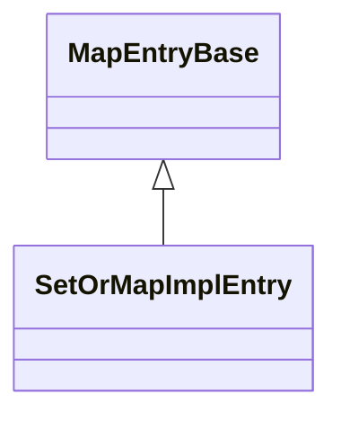

# SetOrMapImplEntry

`SetOrMapImplEntry` is a final class template
defined in [`Fw/DataStructures`](sdd.md).
It represents an iterator for a set or a map implementation.

## 1. Template Parameters

`SetOrMapImplEntry` has the following template parameters.

|Kind|Name|Purpose|
|----|----|-------|
|`typename`|`KE`|The type of a key in a map or the element of a set|
|`typename`|`VN`|The type of a value in a map or [`Nil`](Nil.md) in a set|

`SetOrMapImplEntry` statically asserts the following:

* `KE` is default constructible.
* `KE` is assignable to `KE&`.
* `VN` is default constructible.
* `VN` is assignable to `VN&`.

## 2. Base Class

`SetOrMapImplEntry<KE, VN>` is publicly derived from the following
templates:

1. [`MapEntryBase<KE, VN>`](MapEntryBase.md).



## 3. Private Member Variables

`SetOrMapImplEntry` has the following private member variables.

|Name|Type|Purpose|Default Value|
|----|----|-------|-------------|
|`m_keyOrElement`|`KE`|The map key or set element|C++ default initialization|
|`m_valueOrNil`|`VN`|The value or [`Nil`](Nil.md)|C++ default initialization|

## 4. Public Constructors and Destructors

### 4.1. Zero-Argument Constructor

```c++
SetOrMapImplEntry()
```

Use default initialization of members.

### 4.2. Constructor Providing Members

```c++
SetOrMapImplEntry(const KE& keyOrElement, const VN& valueOrNil)
```

1. Set `m_keyOrElement = keyOrElement`.

2. Set `m_valueOrNil = valueOrNil`.

### 4.3. Copy Constructor

```c++
SetOrMapImplEntry(const SetOrMapImplEntry<KE, VN>& iterator)
```

Set `*this = iterator`.

### 4.4. Destructor

```c++
~SetOrMapImplEntry() override
```

Defined as `= default`.

## 5. Public Member Functions

### 5.1. operator=

```c++
SetOrMapImplEntry& operator=(const SetOrMapImplEntry&<KE, VN> iterator)
```

1. If `this != &iterator`

    1. Set `m_keyOrElement = iterator.keyOrElement`.

    1. Set `m_valueOrNil = iterator.valueOrNil`.

### 5.3. getElement

```c++
const KE& getElement() const
```

Return a reference to `m_keyOrElement`.

### 5.2. getKey

```c++
const KE& getKey() const override
```

Return a reference to `m_keyOrElement`.

### 5.3. getValue

```c++
const VN& getValue() const override
```

Return a reference to `m_valueOrNil`.

### 5.6. setKeyOrElement

```c++
void setKeyOrElement(const KE& keyOrElement) const
```

Set `m_keyOrElement = keyOrElement`.

### 5.7. setValueOrNil

```c++
void setValueOrNil(const VN& valueOrNil) const
```

Set `m_valueOrNil = valueOrNil`.
