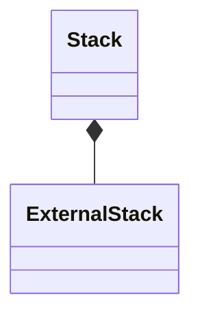

# Stack

`Stack` is a `final` class template
defined in [`Fw/DataStructures`](sdd.md).
It represents a stack with internal storage.

## 1. Template Parameters

`Stack` has the following template parameters.

|Kind|Name|Purpose|
|----|----|-------|
|`typename`|`T`|The type of a stack item|
|`FwSizeType`|`C`|The stack capacity in items|

`Stack` statically asserts the following:

* `T` is default constructible.
* `C > 0`.

## 2. Base Class

`Stack<T>` is publicly derived from 
[`StackBase<T>`](StackBase.md).

## 3. Private Member Variables

`Stack` has the following private member variables.

|Name|Type|Purpose|Default Value|
|----|----|-------|-------------|
|`m_extStack`|`ExternalStack<T>`|The external stack implementation|C++ default initialization|
|`m_items`|`T[C]`|The array providing the backing memory for `m_extStack`|C++ default initialization|



## 4. Public Constructors and Destructors

### 4.1. Zero-Argument Constructor

```c++
Stack()
```

Initialize `m_extStack` with `ExternalStack<T>(m_items, C)`.

_Example:_
```c++
Stack<U32, 10> stack;
```

### 4.2. Copy Constructor

```c++
Stack(const Stack<T, S>& stack)
```

Set `*this = stack`.

_Example:_
```c++
Stack<U32, 10> q1;
auto status = q1.push(3);
ASSERT_EQ(status, Success::SUCCESS);
Stack<U32, 10> q2(q1);
ASSERT_EQ(q2.size(), 1);
U32 value = 0;
status = q2.pop(value);
ASSERT_EQ(status, Success::SUCCESS);
ASSERT_EQ(value, 3);
```

### 4.3. Destructor

```c++
~Stack() override
```

Defined as `= default`.

## 5. Public Member Functions

### 5.1. operator=

```c++
Stack<T>& operator=(const Stack<T>& stack)
```

Call `m_extStack.copyDataFrom(stack)`.

_Example:_
```c++
Stack<U32, 10> q1;
auto status = q1.push(3);
ASSERT_EQ(status, Success::SUCCESS);
Stack<U32, 10> q2;
ASSERT_EQ(q2.size(), 0);
q2 = q1;
ASSERT_EQ(q2.size(), 1);
U32 value = 0;
status = q2.pop(value);
ASSERT_EQ(status, Success::SUCCESS);
ASSERT_EQ(value, 3);
```

### 5.2. clear

```c++
void clear() override
```

Call `m_extStack.clear()`.

### 5.3. push

```c++
Success push(const T& e) override
```

Return `m_extStack.push(e)`.

### 5.4. at

```c++
const T& at(FwSizeType index) const override
```

Return `m_extStack.at(index)`.

### 5.5. pop

```c++
Success pop(T& e) override
```

Return `m_extStack.pop(e)`.

### 5.6. getSize

```c++
FwSizeType getSize() const override
```

Return `m_extStack.getSize()`.

### 5.7. getCapacity

```c++
FwSizeType getCapacity() const override
```

Return `m_extStack.getCapacity()`.

## 6. Public Static Functions

### 6.1. getStaticCapacity

```c++
static constexpr FwSizeType getStaticCapacity()
```

Return the static capacity `C`.

_Example:_
```c++
const auto capacity = Stack<U32, 3>::getStaticCapacity();
ASSERT_EQ(capacity, 3);
```
