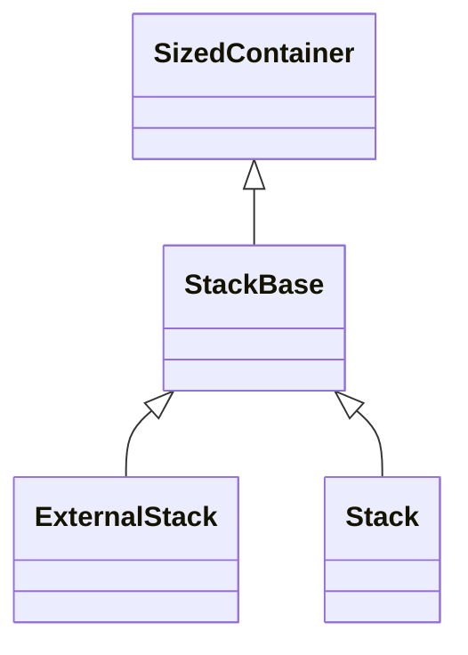
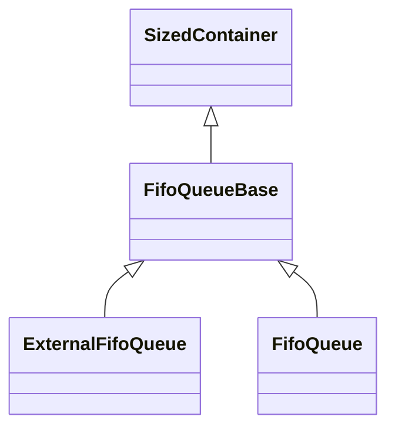
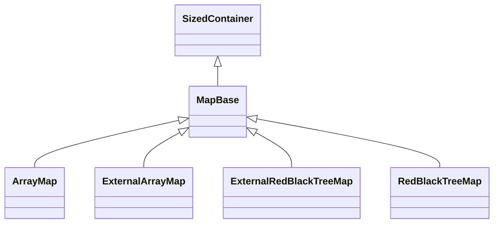
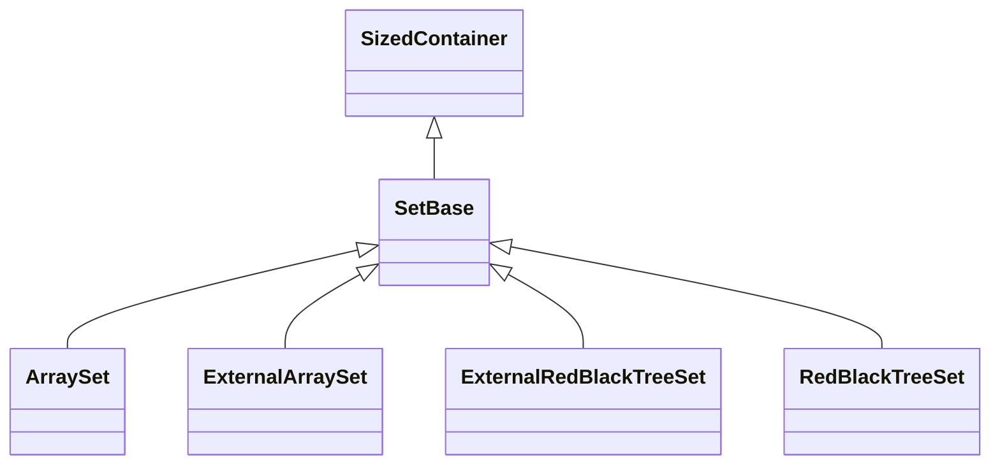

# Fw/DataStructures: Basic Data Structures

`Fw/DataStructures` contains a library of basic data structures.
All the definitions in this directory are in the
namespace `Fw`.

The data structures defined here use the following concepts:

* **size:** The number of elements currently stored in a data structure.

* **capacity:** The maximum number of elements stored in a data structure.

For a fixed-size array, the size and the capacity are the same.
For other data structures, the size and the capacity are not
in general the same.
For example, a map has a capacity _C_ and a size _S_ between 0 
and _C_.

The data structures in this directory are **sequential data structures**,
i.e., they do not support direct concurrent access by multiple threads.
To use these data structures in a multithreaded context, you need
to provide separate concurrency control.
The most common way to do this is to make the data
structure a member of an active or queued component and to use
the component queue to guard the access to the structure.

## 1. Arrays

An **array** _A_ stores _S_ elements for _S > 0_ at indices
0, 1, ..., _S_ - 1.
The elements are stored in **backing memory** _M_.
An array provides bounds-checked access to the array elements
stored in _M_.

`Fw/DataStructures` provides the following array templates:

|Name|Description|
|----|-----------|
|[`Array`](Array.md)|A bounds-checked array with internal memory for storing the array elements|
|[`ExternalArray`](ExternalArray.md)|A bounds-checked array with external memory for storing the array elements|

## 2. Stacks

A **stack** is a data structure that provides push and pop
operations in last-in-first-out (LIFO) order.

### 2.1. Templates

`Fw/DataStructures` provides the following stack templates:

|Name|Description|
|----|-----------|
|[`ExternalStack`](ExternalStack.md)|A stack with external memory for storing the stack items|
|[`Stack`](Stack.md)|A stack with internal memory for storing the stack items|
|[`StackBase`](StackBase.md)|The abstract base class for a stack|

### 2.2. Class Diagram

`StackBase` is a derived class of [`SizedContainer`](SizedContainer.md),
which represents a generic container with a capacity and a size.

## 3. FIFO Queues

A **FIFO queue** is a data structure that
provides enqueue and dequeue operations in
first-in-first-out (FIFO) order.

### 3.1. Templates

`Fw/DataStructures` provides the following FIFO queue templates:

|Name|Description|
|----|-----------|
|[`ExternalFifoQueue`](ExternalFifoQueue.md)|A FIFO queue with external memory for storing the queue items|
|[`FifoQueue`](FifoQueue.md)|A FIFO queue with internal memory for storing the queue items|
|[`FifoQueueBase`](FifoQueueBase.md)|The abstract base class for a FIFO queue|

The queue implementations use a template called 
[`CircularIndex`](CircularIndex.md)
for representing a **circular index**, i.e., an index that wraps around modulo 
an integer.
You can use this template to represent any circular index.

### 3.2. Class Diagram

`FifoQueueBase` is a derived class of [`SizedContainer`](SizedContainer.md),
which represents a generic container with a capacity and a size.

## 4. Maps

A **map** is a data structure that associates keys to values.
It provides insert, remove, and find operations.

### 4.1. Templates

`Fw/DataStructures` provides the following map templates:

|Name|Description|
|----|-----------|
|[`ArrayMap`](ArrayMap.md)|An array-based map with internal memory for storing the array|
|[`ExternalArrayMap`](ExternalArrayMap.md)|An array-based map with external memory for storing the array|
|[`ExternalRedBlackTreeMap`](ExternalRedBlackTreeMap.md)|A red-black tree with external memory for storing the tree|
|[`MapBase`](MapBase.md)|The abstract base class for a map|
|[`RedBlackTreeMap`](RedBlackTreeMap.md)|A red-black tree with internal memory for storing the tree|

### 4.2. Class Diagram

`MapBase` is a derived class of [`SizedContainer`](SizedContainer.md),
which represents a generic container with a capacity and a size.

## 5. Sets

A **set** is a data structure that contains elements.
It provides insert, remove, and find operations.

### 5.1. Templates

|Name|Description|
|----|-----------|
|[`ArraySet`](ArraySet.md)|An array-based set with internal memory for storing the array|
|[`ExternalArraySet`](ExternalArraySet.md)|An array-based set with external memory for storing the array|
|[`ExternalRedBlackTreeSet`](ExternalRedBlackTreeSet.md)|A red-black tree with external memory for storing the tree|
|[`RedBlackTreeSet`](RedBlackTreeSet.md)|A red-black tree with internal memory for storing the tree|
|[`SetBase`](SetBase.md)|The abstract base class for a set|

### 5.2. Class Diagram

`SetBase` is a derived class of [`SizedContainer`](SizedContainer.md),
which represents a generic container with a capacity and a size.
