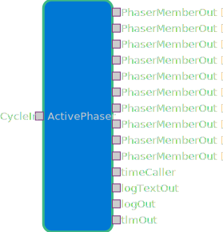

# Svc::ActivePhaser

`Svc::ActivePhaser` is an active component that drives a set of components connected to `Svc::Sched` output ports.
It periodically schedules port calls by dividing each periodic cycle into ticks and mapping each port call to a window of ticks.
Port calls are invoked in the order of their registrations during phaser configuration.

In the example below, a phaser cycle consists of 10 ticks.
Port call A (with a length of 2) is set to start at tick 0,
port call B (with a length of 3) to start at tick 2,
and port call C (with a length of 1) to start at tick 6 & 8.
The schedule repeats every 10 ticks.

If a port call is specified a length, this component checks
if the call overruns its specified length at runtime.

## Requirements

The requirements for `Svc::ActivePhaser` are as follows:

Requirement | Description | Verification Method
----------- | ----------- | -------------------
AP-001 | The `Svc::ActivePhaser` component shall be active and will be woken up by an input asynchronous port call | Inspection, Unit test
AP-002 | The `Svc::ActivePhaser` component shall invoke its output ports in the order of port call registrations | Unit Test
AP-003 | The `Svc::ActivePhaser` component shall report a `MissedDeadline` warning event when a port call overruns its specified length  | Unit Test

## Design

### Component Diagram

The `Svc::ActivePhaser` component has the following component diagram:

### Ports

The `Svc::ActivePhaser` component uses the following port types:

Port Data Type | Name | Direction | Kind | Usage
-------------- | ---- | --------- | ---- | -----
[`Svc::Cycle`](../../Sched/docs/sdd.md) | CycleIn | Input | Asynchronous | Receive a call to run one cycle of the phaser
[`Svc::Sched`](../../Sched/docs/sdd.md) | PhaserMemberOut | Output | n/a | Phaser ports

### Port Descriptions

| Name | Description |
|---|---|
| CycleIn | Scheduling input port for executing a phaser cycle |
| PhaserMemberOut | Output ports for invoking downstream components |
| timeCaller | Port for requesting current time for telemetry timestamps |
| logTextOut | Text event port for logging messages |
| logOut | Event port for binary logs |
| tlmOut | Port for sending telemetry channels to downlink |

### Events

| Name | Description |
|---|---|
| MissedDeadline | Emitted when a port call overruns its specified length |

## Unit Tests

To see unit test coverage run fprime-util check --coverage
