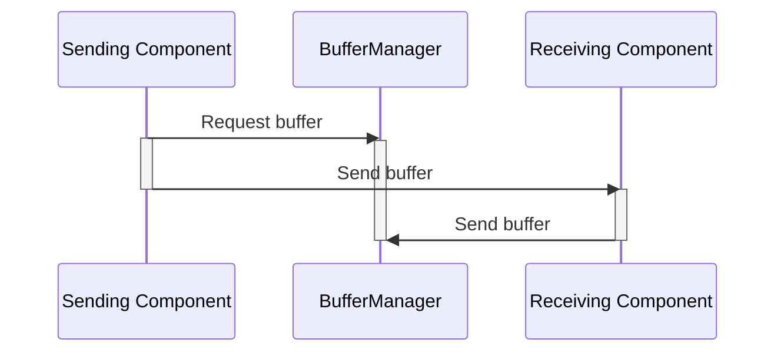

# Svc::BufferManager

## 1 Introduction

`BufferManager` is a passive ISF component.
It allocates a set of fixed-sized buffers as specified by the user. The overall memory for the buffers is allocated by a memory allocator provided to the component at runtime.

## 2 Requirements

Requirement | Description | Rationale | Verification Method
---- | ---- | ---- | ----
FPRIME-BM-001 | `BufferManager` shall allow the specification of multiple bins of buffers based on the size of the buffer|Allows for some optimization of memory usage if buffers of varying sizes are needed|Test|
FPRIME-BM-002 | `BufferManager` shall allocate the first buffer larger than the requested size from the set of unallocated buffers, starting with the smallest set of buffers.|If a buffer from a smaller pool is not available, allow using larger buffers to avoid starving the user| Test|
FPRIME-BM-003 | `BufferManager` shall return an empty buffer (size = 0) if no buffers are available|Allow the user to decide how to react to no memory|Test|
FPRIME-BM-004 | `BufferManager` shall accept empty returned buffers without an assert|Just send a warning to cover the case where an empty buffer is returned by a component|Test
FPRIME-BM-005 | `BufferManager` shall use a provided Fw::MemAllocator instance to request overall buffer memory|Let the user decide where the memory comes from|Test
FPRIME-BM-006 | `BufferManager` shall allow buffers to be returned in any order|Do not restrict the lifetime or usage of buffers|Test

## 3 Design

### 3.1 Assumptions

The design of `BufferManager` assumes the following:

1. `BufferManager` has some maximum number of outstanding allocations, 
set at component initialization, that is never exceeded.

2. The store maintained by `BufferManager` has a fixed size, 
set at component initialization.
This fixed size is never exceeded by the outstanding allocations.

### 3.2 Block Description Diagram (BDD)


### 3.3 Ports

#### 3.3.1 Role Ports

Name | Type | Role
-----| ---- | ----
`timeCaller` | `Fw::Time` | TimeGet
`tlmOut` | [`Fw::Tlm`](../../../Fw/Tlm/docs/sdd.md) | Telemetry
`eventOut` | [`Fw::LogEvent`](../../../Fw/Log/docs/sdd.md) | LogEvent

#### 3.3.2 Component-Specific Ports

Name | Type | Kind | Purpose
---- | ---- | ---- | ----
`bufferSendIn` | [`Fw::BufferSend`](../../../Fw/Buffer/docs/sdd.md) | guarded input | Receives buffers for deallocation
`bufferGetCallee` | [`Fw::BufferGet`](../../../Fw/Buffer/docs/sdd.md) | guarded input (callee) | Receives requests for allocated buffers and returns the buffers
`schedIn` | [`Svc::Sched`](../../../Svc/Sched/docs/sdd.md) | sync input (callee) | writes telemetry values (optional, if the user doesn't need BufferManager telemetry)

### 3.4 Constants

`BufferManager` maintains the following constants:

* *BUFFERMGR_MAX_NUM_BINS*: The maximum number of bins (i.e. buffers pool of different sizes)

### 3.5 State

`BufferManager` maintains the following state:

* *m_buffers*: A set of buffers to allocate to users.

* *AllocatedBuffer::allocated*: Indicates whether a particular buffer in the pool has been allocated to the user.

### 3.6 Port Behavior

#### 3.6.1 bufferGetCallee

When `BufferManager` receives a request for a buffer of size *s* on
[*bufferGetCallee*](#bufferGetCallee), it carries out the following steps:

1. Search for an unallocated buffer that is big enough to hold the requested buffer size.
2. Mark the buffer as allocated.
3. Return the `Fw::Buffer` instance to the user.
4. If a free buffer cannot be found, return an empty buffer to the user.

#### 3.6.2 bufferSendIn

When `BufferManager` receives notification of a free buffer on
[*bufferSendIn*](#bufferSendIn), it carries out the following steps:

1. Check to see if it is an empty buffer. If so, issue a WARNING_LO event and return.
2. Extract the manager ID and buffer ID from the context member of the `Fw::Buffer` instance.
3. If they are valid, use the buffer ID to find the allocated buffer.
4. Clear the "allocated" flag to make the buffer available again.

#### 3.6.3 schedIn

The `schedIn` port is optional. It doesn't need to be connected for `BufferManager` to function correctly. When `BufferManager` receives a call on this port, it will write all the defined telemetry values.

### 3.7 Sequence Diagram

The following sequence diagram shows the procedure for sending a buffer
from one component to another:

1. The sending component requests a buffer *B* on the
[`bufferGetCallee`](#bufferGetCallee) port of `BufferManager`.

2. The sending component fills *B* with data and sends it to the receiving
component.

3. The receiving component uses the data in *B*. When done, it sends *B* back
to the [`bufferSendIn`](#bufferSendIn) port of `BufferManager` for deallocation.



### 3.8 Assertions

`BufferManager` will assert under the following conditions:

* A returned buffer has the incorrect manager ID.
* A returned buffer has an incorrect buffer ID.
* A returned buffer is returned with a correct buffer ID, but it isn't already allocated.
* A returned buffer has an indicated size larger than originally allocated.
* A returned buffer has a pointer different than the one originally allocated.

## 4 Configuration

### 4.1 Constants

The maximum number of buffer bins is configured in the config file [`config/BufferManagerComponentImplCfg.hpp`](../../../default/config/BufferManagerComponentImplCfg.hpp):

```cpp
namespace Svc {
    static const U16 BUFFERMGR_MAX_NUM_BINS = 10;
}
```

### 4.2 Runtime Setup

To configure an instance of `BufferManager`, the following needs to be supplied to its `setup()` method:
- `mgrID`: A unique manager ID for buffer checking
- `memID`: ID passed to the memory allocator
- `allocator`: An `Fw::MemAllocator` instance
- `bins`: A `BufferBins` structure defining the buffer pools (size and number). This is defined by the user, as demonstrated below.

The `setup` method configures the buffer bins, allocates memory for all buffers, and initializes the buffer tracking structures.

### 4.3 Buffer Bins Configuration

Buffer bins are defined using the `BufferBins` structure, which contains an array of `BufferBin` entries. Each bin entry specifies:
- `bufferSize`: The size of each buffer in the bin (in bytes)
- `numBuffers`: number of buffers of `bufferSize` to allocate for this bin

Choosing appropriate buffer sizes and counts depends on the expected usage patterns of the system. Users should analyze their application's memory requirements to determine optimal configurations.

**Example configuration:**

```cpp
Svc::BufferManager::BufferBins bins;
memset(&bins, 0, sizeof(bins));
bins.bins[0].bufferSize = 256;   // Small buffers
bins.bins[0].numBuffers = 10;    // 10 small buffers

bins.bins[1].bufferSize = 1024;  // Medium buffers
bins.bins[1].numBuffers = 5;     // 5 medium buffers

bins.bins[2].bufferSize = 4096;  // Large buffers
bins.bins[2].numBuffers = 2;     // 2 large buffers

bufferManager.setup(1, 0, allocator, bins);
```

A real-world usage and configuration example can be found in the [`Svc.ComCcsds` subtopology](../../Subtopologies/ComCcsds/).
