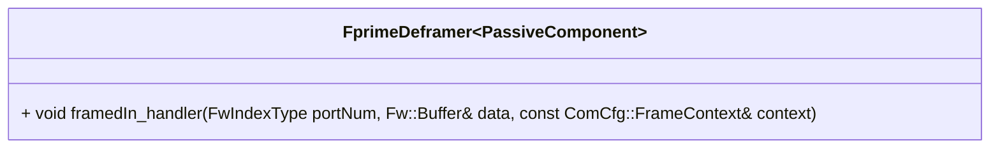

# Svc::FprimeDeframer

The `Svc::FprimeDeframer` component receives F´ frames on its input port, takes off the header and trailer (sometimes referred to as "footer"), and passes the encapsulated payload to a downstream component (usually the [`Svc.FprimeRouter`](../../FprimeRouter/docs/sdd.md)).

Following the [F Prime Protocol frame specification](../../FprimeProtocol/docs/sdd.md), the `Svc::FprimeDeframer` validates the passed in `Fw.Buffer` to ensure it represents a valid frame (see [Frame validation](#frame-validation)), extract the payload from the frame, and outputs the payload on the `deframedOut` output port.

## Internals

The `Svc::FprimeDeframer` component is an implementation of the [DeframerInterface](../../Interfaces/DeframerInterface.fppi) for the F´ communications protocol. It receives an F´ frame (in a [Fw::Buffer](../../../Fw/Buffer/docs/sdd.md) object) on its `framedIn` input port, modifies the input buffer to remove the header and trailer, and sends it out through its `deframedOut` output port. 

Ownership of the buffer is transferred to the component connected to the `deframedOut` output port. The input buffer is modified by subtracting the header and trailer size from the buffer's length, and offsetting the buffer's data pointer to point to the start of the packet data.

The `Svc::FprimeDeframer` component does not perform any validation of the frame. It is expected that the frame is valid and well-formed. The validation should be performed by an upstream component, such as [`Svc::FrameAccumulator`](../../FrameAccumulator/docs/sdd.md).

The `Svc::FprimeDeframer` does not support deframing multiple packets in a single frame (i.e. concatenated packets) as this is not supported by the F´ communications protocol.

### Frame validation

The passed-in `data` field (of type `Fw::Buffer`) of the `Svc.ComDataWithContext` input port is validated for the following conditions:
- The buffer is large enough to contain the header and trailer
- The buffer starts with the F´ start word
- The buffer length is equal to (or larger than) the packet length field in the frame header
- The CRC field of the frame is equal to the CRC calculated over the frame header and payload

If any of these conditions are not met, the frame is dropped meaning no payload is passed to the output port and the input `Fw::Buffer` is deallocated.

## Usage Examples

The `Svc::FprimeDeframer` component is used in the uplink stack of many reference F´ application such as [the tutorials source code](https://github.com/fprime-community#tutorials).

## Diagrams

The below diagram shows a typical configuration in which the `Svc::FprimeDeframer` can be used. This is the configuration used in the [the tutorials source code](https://github.com/fprime-community#tutorials). It is receiving accumulated frames from a [Svc::FrameAccumulator](../../FrameAccumulator/docs/sdd.md) and passes packets to a [Svc::FprimeRouter](../../FprimeRouter/docs/sdd.md) for routing to other components.

## Class Diagram

## Requirements

Requirement | Description | Rationale | Verification Method
----------- | ----------- | ----------| -------------------
SVC-DEFRAMER-001 | `Svc::FprimeDeframer` shall extract the payload field from input buffers that represent a valid F Prime frame as specified by the [F Prime Protocol](../../FprimeProtocol/docs/sdd.md) | Deframe valid frames and extract payload | Unit test |
SVC-DEFRAMER-002 | `Svc::FprimeDeframer` shall deallocate input buffers that are not a valid F Prime frame as specified by the [F Prime Protocol](../../FprimeProtocol/docs/sdd.md) | Drop invalid frames | Unit test |

## Port Descriptions

| Kind | Name | Type | Description |
|---|---|---|---|
| `guarded input` | framedIn | `Svc.ComDataWithContext` | Receives a frame with optional context data |
| `output` | deframedOut | `Svc.ComDataWithContext` | Receives a frame with optional context data |
| `output` | bufferDeallocate | `Fw.BufferSend` | Port for deallocating dropped frames |
