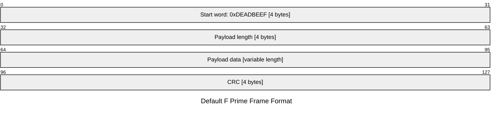

# The F Prime communications protocol

The F Prime protocol is a minimal communications protocol that is used by default in by F Prime applications. It is a protocol that is used for both uplink and downlink communications, designed to get started with the F´ GDS quickly. It does not provide any advanced features and is primarily meant for testing purposes. is used to encapsulate packets of data that are sent between the ground and the spacecraft. It is implemented on both the spacecraft and the Ground (GDS) side.

A frame for F Prime protocol consists of 4 fields:
- Start word: A 32-bit start word that is used to identify the start of a frame. The start word is always `0xDEADBEEF`.
- Payload length: A 32-bit field that specifies the length of the payload data in bytes.
- Payload data: A variable-length field that contains the payload data (usually an [F Prime packet](../../../Fw/Com/ComPacket.hpp)), of length specified by the payload length field.
- CRC: A 32-bit CRC field that is used to verify the integrity of the frame.

## F Prime frame format

The F Prime frame format is as specified in the following diagram.

> [!NOTE]
> Because the payload length token is 4 bytes long, the F Prime protocol does not support packets larger than 2^32 - 1 bytes (~4 GB).
