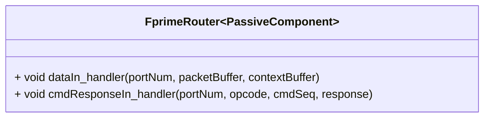

# Svc::FprimeRouter

The `Svc::FprimeRouter` component routes F´ packets (such as command or file packets) to other components.

The `Svc::FprimeRouter` component receives F´ packets (as [Fw::Buffer](../../../Fw/Buffer/docs/sdd.md) objects) and routes them to other components through synchronous port calls. The input port of type `Svc.ComDataWithContext` passes this Fw.Buffer object along with optional context data which can help for routing. The current F Prime protocol does not use this context data, but is nevertheless present in the interface for compatibility with other protocols which may for example pass APIDs in the frame headers.

The `Svc::FprimeRouter` component supports `Fw::ComPacket::FW_PACKET_COMMAND` and `Fw::ComPacket::FW_PACKET_FILE` packet types. Unknown packet types are forwarded on the `unknownDataOut` port, which a project-specific component can connect to for custom routing. In the case of unknown data being forwarded, the ownership of the packet data `Fw::Buffer` object is passed to the receiver.

## Usage Examples

The `Svc::FprimeRouter` component is used in the uplink stack of many reference F´ application such as [the tutorials source code](https://github.com/fprime-community#tutorials).

### Typical Usage

In the canonical uplink communications stack, `Svc::FprimeRouter` is connected to a [Svc::CmdDispatcher](../../CmdDispatcher/docs/sdd.md) and a [Svc::FileUplink](../../FileUplink/docs/sdd.md) component, to receive Command and File packets respectively.

## Class Diagram

## Port Descriptions

| Name | Description | Type |
|---|---|---|
| `dataIn: Svc.ComDataWithContext` | Receiving Fw::Buffer with context buffer from Deframer | `guarded input` |
| `commandOut: Fw.Com` | Port for sending command packets as Fw::ComBuffers | `output` |
| `fileOut: Fw.BufferSend` | Port for sending file packets as Fw::Buffer (ownership passed to receiver) | `output` |
| `unknownDataOut: Svc.ComDataWithContext` | Port forwarding unknown data (useful for adding custom routing rules with a project-defined router) | `output` |
| `output`| bufferDeallocate | `Fw.BufferSend` | Port for deallocating buffers once routed |

## Requirements

| Name | Description | Rationale | Validation |
|---|---|---|---|
SVC-ROUTER-001 | `Svc::FprimeRouter` shall route packets based on their packet type as indicated by the packet header | Routing mechanism of the F´ comms protocol | Unit test |
SVC-ROUTER-002 | `Svc::FprimeRouter` shall route packets of type `Fw::ComPacket::FW_PACKET_COMMAND` to the `commandOut` output port. | Routing command packets | Unit test |
SVC-ROUTER-003 | `Svc::FprimeRouter` shall route packets of type `Fw::ComPacket::FW_PACKET_FILE` to the `fileOut` output port. | Routing file packets | Unit test |
SVC-ROUTER-004 | `Svc::FprimeRouter` shall route data that is neither `Fw::ComPacket::FW_PACKET_COMMAND` nor `Fw::ComPacket::FW_PACKET_FILE` to the `unknownDataOut` output port. | Allows for projects to provide custom routing for additional (project-specific) uplink data types | Unit test |
SVC-ROUTER-005 | `Svc::FprimeRouter` shall emit warning events if serialization errors occur during processing of incoming packets | Aid in diagnosing uplink issues | Unit test |
