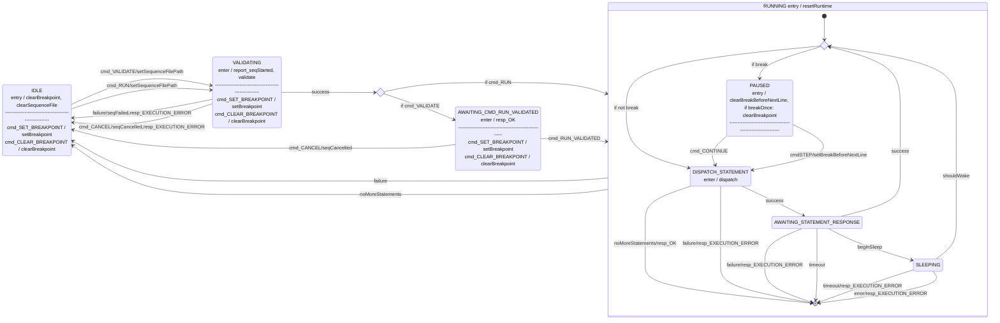

# Svc::FpySequencer

**The FpySequencer is currently in development. Use at own risk**

The FpySequencer loads, validates and runs up to one Fpy sequence at a time.

The FpySequencer is primarily composed of a state machine and a runtime environment. The state machine controls the loading, validation, starting and stopping of the sequence, and the actual execution takes place in a sectioned-off runtime.

The FpySequencer runs files compiled by `fprime-fpyc` (in the `fprime-gds` package). See the compiler documentation for the details of the Fpy language.

> [!CAUTION]
> The FpySequencer depends on `float` and `double` conforming to IEEE-754 standard on the target system. Users should ensure `SKIP_FLOAT_IEEE_754_COMPLIANCE` is defined as `0` to guarantee compliance.

## Requirements

| **ID**      | **Requirement**                                                                                                                                   | **Verification**                |
| ----------- | ------------------------------------------------------------------------------------------------------------------------------------------------- | ------------------------------- |
| FPY-SEQ-001 | The sequencer shall support branching on conditionals.                                                                                            | Unit Test                       |
| FPY-SEQ-002 | The sequencer shall support arithmetic and logical operations.                                                                                    | Unit Test                       |
| FPY-SEQ-003 | The sequencer shall support accessing telemetry.                                                                                                  | Unit Test                       |
| FPY-SEQ-004 | The sequencer shall support accessing the parameter database.                                                                                     | Unit Test                       |
| FPY-SEQ-005 | The sequencer shall support calling subroutines with arguments and a single return value.                                                         | Unit Test                       |
| FPY-SEQ-006 | The sequencer shall support scoped variables.                                                                                                     | Unit Test                       |
| FPY-SEQ-007 | The sequencer shall support executing commands at relative times.                                                                                 | Unit Test                       | 
| FPY-SEQ-008 | The sequencer shall support executing commands at absolute times.                                                                                 | Unit Test                       | 
| FPY-SEQ-009 | The sequencer shall support sequence-local variables.                                                                                             | Unit Test                       |
| FPY-SEQ-010 | The sequencer shall support executing directives with arguments.                                                                                  | Unit Test                       |
| FPY-SEQ-011 | The sequencer shall support running sequences with arguments.                                                                                     | Unit Test                       |
| FPY-SEQ-012 | The sequencer shall read a binary-encoded sequence file of the format described in [TBD]()                                                        | Unit Test                       |
| FPY-SEQ-013 | The sequencer shall send commands for dispatch.                                                                                                   | Unit Test                       |
| FPY-SEQ-014 | The sequencer shall support parameterized sequences.                                                                                              | Unit Test                       |
| FPY-SEQ-015 | The sequencer shall support the directives described in the [Directives](#directives) section.                                                    | Unit Test                       |

## States

The following diagram represents the states of the `FpySequencer`.

## Flags
The FpySequencer supports certain boolean flags which control the behavior of the sequencer while running a sequence. The flags can be accessed and modified by the sequence itself, or by command while a sequence is running. When a sequence starts running, the flags are initialized to a value configured by the FLAG_DEFAULT_XYZ parameters.

| Name | Description | Default value (configurable) |
|---|------------|---|
|EXIT_ON_CMD_FAIL|if true, the sequence will exit with an error if a command fails|false|

## Commands
| Name | Description |
|-----|-----|
| RUN | Loads, validates and runs a sequence |
| VALIDATE | Loads and validates a sequence. Mutually exclusive with RUN |
| RUN_VALIDATED | Must be called after VALIDATE. Runs the sequence that was validated. |
| CANCEL | Cancels a running or validated sequence. After running CANCEL, the sequencer should return to IDLE |
| SET_FLAG | Sets the value of a flag |

## Debugging Commands
The FpySequencer has a set of debugging commands which can be used to pause and step through sequences. They should not be necessary for nominal use cases.

| Name | Description |
|-----|-----|
| SET_BREAKPOINT | Sets a breakpoint at the specified statement index. When reached, execution will pause before dispatching that statement. |
| BREAK | Immediately pauses execution before dispatching the next statement. Will break once, then continue normal execution. |
| CONTINUE | Continues automatic execution of the sequence after it has been paused. If a breakpoint is still set, execution may pause again. |
| CLEAR_BREAKPOINT | Clears any set breakpoint, but does not continue executing the sequence. |
| STEP | When paused, executes the next statement then returns to paused state. Not valid during automatic execution. |

## Directives
| Opcode | Name | Description |
|---|------|-------------|
| 1 | WAIT_REL | Sleeps for a time duration relative to the current time |
| 2 | WAIT_ABS | Sleeps until an absolute time is reached |
| 4 | GOTO | Sets the index of the next statement to be executed |
| 5 | IF | Pops a byte off the stack. If 0, goto a specified statement index, otherwise proceed |
| 6 | NO_OP | Does nothing |
| 7 | STORE_TLM_VAL | Stores a telemetry buffer in the lvar array |
| 8 | STORE_PRM | Stores a parameter buffer in the lvar array |
| 9 | CONST_CMD | Dispatches a command with constant arguments |
| 10 | OR | Pops two bytes off the stack. If either one is != 0, pushes 1 to stack, otherwise 0 |
| 11 | AND | Pops two bytes off the stack. If both are != 0, pushes 1 to stack, otherwise 0 |
| 12 | IEQ | Pops two 8-byte integers off the stack. If they are bitwise equal, pushes 1 to stack, otherwise 0 |
| 13 | INE | Pops two 8-byte integers off the stack. If they are not bitwise equal, pushes 1 to stack, otherwise 0 | 
| 14 | ULT | Pops two 8-byte unsigned integers off the stack. If the second < first, pushes 1 to stack, otherwise 0 |
| 15 | ULE | Pops two 8-byte unsigned integers off the stack. If the second <= first, pushes 1 to stack, otherwise 0 |
| 16 | UGT | Pops two 8-byte unsigned integers off the stack. If the second > first, pushes 1 to stack, otherwise 0 |
| 17 | UGE | Pops two 8-byte unsigned integers off the stack. If the second >= first, pushes 1 to stack, otherwise 0 |
| 18 | SLT | Pops two 8-byte signed integers off the stack. If the second < first, pushes 1 to stack, otherwise 0 |
| 19 | SLE | Pops two 8-byte signed integers off the stack. If the second <= first, pushes 1 to stack, otherwise 0 |
| 20 | SGT | Pops two 8-byte signed integers off the stack. If the second > first, pushes 1 to stack, otherwise 0 |
| 21 | SGE | Pops two 8-byte signed integers off the stack. If the second >= first, pushes 1 to stack, otherwise 0 |
| 22 | FEQ | Pops two 8-byte floats off the stack. If neither is NaN and they are otherwise equal, pushes 1 to stack, otherwise 0. Infinity is handled consistent with C++ |
| 23 | FNE | Pops two 8-byte floats off the stack. If either is NaN or they are not equal , pushes 1 to stack, otherwise 0. Infinity is handled consistent with C++ |
| 24 | FLT | Pops two 8-byte floats off the stack. If neither is NaN and the second < first, pushes 1 to stack, otherwise 0. Infinity is handled consistent with C++ |
| 25 | FLE | Pops two 8-byte floats off the stack. If neither is NaN and the second <= first, pushes 1 to stack, otherwise 0. Infinity is handled consistent with C++ |
| 26 | FGT | Pops two 8-byte floats off the stack. If neither is NaN and the second > first, pushes 1 to stack, otherwise 0. Infinity is handled consistent with C++ |
| 27 | FGE | Pops two 8-byte floats off the stack. If neither is NaN and the second >= first, pushes 1 to stack, otherwise 0. Infinity is handled consistent with C++ |
| 28 | NOT | Pops a byte off the stack. If it is != 0, push 0 to stack, otherwise 1 |
| 29 | FPTOSI | Pops an 8-byte float off the stack, cast it to a signed 8-byte integer and push to the stack |
| 30 | FPTOUI | Pops an 8-byte float off the stack, cast it to an unsigned 8-byte integer and push to the stack |
| 31 | SITOFP | Pops a signed 8-byte integer off the stack, cast it to an 8-byte float and push to the stack |
| 32 | UITOFP | Pops an unsigned 8-byte integer off the stack, cast it to an 8-byte float and push to the stack |
| 33 | IADD | Pops two 8-byte integers off the stack. Adds them and pushes the result to stack |
| 34 | ISUB | Pops two 8-byte integers off the stack. Subtracts them and pushes the result to stack |
| 35 | IMUL | Pops two 8-byte integers off the stack. Multiplies them and pushes the result to stack |
| 36 | UDIV | Pops two 8-byte unsigned integers off the stack. Divides them and pushes the result to stack. A divisor of 0 will result in DOMAIN_ERROR. |
| 37 | SDIV | Pops two 8-byte signed integers off the stack. Divides them and pushes the result to stack. A divisor of 0 will result in DOMAIN_ERROR. |
| 38 | UMOD | Pops two 8-byte unsigned integers off the stack. Computes modulo and pushes the result to stack. A 0 divisor (rhs) will result in DOMAIN_ERROR. |
| 39 | SMOD | Pops two 8-byte signed integers off the stack. Computes modulo and pushes the result to stack. A 0 divisor (rhs) will result in DOMAIN_ERROR. |
| 40 | FADD | Pops two 8-byte floats off the stack. Adds them and pushes the result to stack.  NaN, and infinity are handled consistently with C++ addition |
| 41 | FSUB | Pops two 8-byte floats off the stack. Subtracts them and pushes the result to stack.  NaN, and infinity are handled consistently with C++ subtraction |
| 42 | FMUL | Pops two 8-byte floats off the stack. Multiplies them and pushes the result to stack.  NaN, and infinity are handled consistently with C++ multiplication |
| 43 | FDIV | Pops two 8-byte floats off the stack. Divides them and pushes the result to stack. Zero divisors, NaN, and infinity are handled consistently with C++ division |
| 44 | FLOAT_FLOOR_DIV | Pops two 8-byte floats off the stack. Performs floor division and pushes the result to stack. Zero divisors, NaN, and infinity are handled consistently with C++ division and `std::floor` |
| 45 | FPOW | Pops two 8-byte floats off the stack. Computes power and pushes the result to stack. NaN and infinity values are handled consistently with C++ `std::pow`. |
| 46 | FLOG | Pops one 8-byte float off the stack. Computes logarithm (base 10) and pushes the result to stack. Negatives yield a DOMAIN_ERROR, NaN and infinity values are handled consistently with C++ `std::log` |
| 47 | FMOD | Pops two 8-byte floats off the stack. Computes modulo and pushes the result to stack. A NaN will produce a NaN result or infinity as either argument yields NaN. |
| 48 | FPEXT | Pops a 4-byte float off the stack, cast it to an 8-byte float and push to the stack |
| 49 | FPTRUNC | Pops an 8-byte float off the stack, cast it to a 4-byte float and push to the stack |
| 50 | SIEXT_8_64 | Sign extends an 8-bit integer to 64 bits |
| 51 | SIEXT_16_64 | Sign extends a 16-bit integer to 64 bits |
| 52 | SIEXT_32_64 | Sign extends a 32-bit integer to 64 bits |
| 53 | ZIEXT_8_64 | Zero extends an 8-bit integer to 64 bits |
| 54 | ZIEXT_16_64 | Zero extends a 16-bit integer to 64 bits |
| 55 | ZIEXT_32_64 | Zero extends a 32-bit integer to 64 bits |
| 56 | ITRUNC_64_8 | Truncates a 64-bit integer to 8 bits |
| 57 | ITRUNC_64_16 | Truncates a 64-bit integer to 16 bits |
| 58 | ITRUNC_64_32 | Truncates a 64-bit integer to 32 bits |
| 59 | EXIT | Pops a byte off the stack. If the byte != 0, end sequence as if it had finished nominally, otherwise end as if a command had failed |
| 60 | ALLOCATE | Pushes a hard-coded count of 0-bytes to the stack |
| 61 | STORE | Pops a hard-coded number of bytes off the stack, and writes them to the local variable array at a hard-coded offset |
| 62 | LOAD | Reads a hard-coded number of bytes from the local variable array at a specific offset, and pushes them to the stack |
| 63 | PUSH_VAL | Pushes a constant array of bytes to the stack |
| 64 | DISCARD | Discards bytes from the top of the stack |
| 65 | MEMCMP | Compares two memory regions on the stack |
| 66 | STACK_CMD | Dispatches a command with arguments from the stack |
| 67 | PUSH_TLM_VAL_AND_TIME | Gets a telemetry channel and pushes its value, and then its time, onto the stack |
| 68 | PUSH_TIME | Pushes the current time, from the `timeCaller` port, to the stack |
| 69 | SET_FLAG | Pops a bool off the stack, sets a flag with a specific index to that bool |
| 70 | GET_FLAG | Gets a flag and pushes its value as a U8 to the stack |
