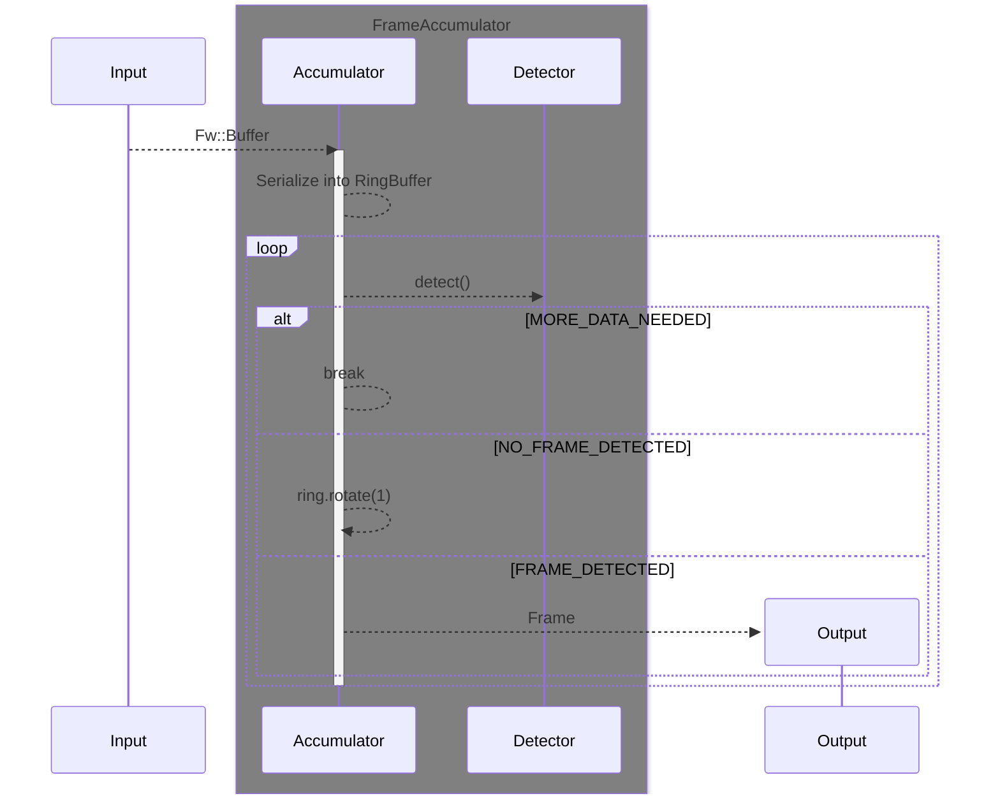
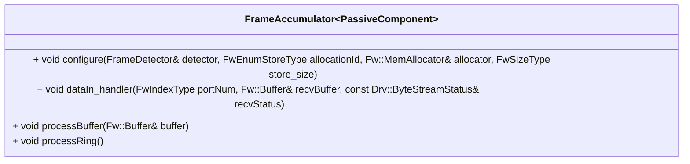

# Svc::FrameAccumulator

The `Svc::FrameAccumulator` component accumulates a stream of data (sequence of [Fw::Buffer](../../../Fw/Buffer/docs/sdd.md) objects) to extract full frames from.

The `Svc::FrameAccumulator` accepts as input a sequence of byte buffers, which typically come from a ground data system via a [ByteStreamDriver](../../../Drv/ByteStreamDriverModel/docs/sdd.md). It extracts the frames from the sequence of buffers and emits them on the `dataOut` output port.

## Internals

### Overview and configuration

The `Svc::FrameAccumulator` accumulates the [Fw::Buffer](../../../Fw/Buffer/docs/sdd.md) objects into a circular buffer ([Utils::CircularBuffer](../../../Utils/Types/CircularBuffer.hpp)). 

The component must be configured with a [`Svc::FrameDetector`](../FrameDetector.hpp) which is responsible for detecting frames in the circular buffer. An implementation of this for the F´ communications protocol is provided by `Svc::FrameDetectors::FprimeFrameDetector`.

The uplink frames need not be aligned on the buffer boundaries, and each frame may span one or more buffers.

### Frame detection

The `Svc::FrameAccumulator` receives `Fw::Buffer` objects on its `dataIn` input port. These buffers are accumulated in a `Utils::CircularBuffer`. Every time a new buffer is accumulated into the circular buffer, the `Svc::FrameAccumulator` enters a loop to `detect()` a frame within the circular buffer, starting at the current head of the circular buffer. The `Svc::FrameDetector` returns one of three results:

- `NO_FRAME_DETECTED`: indicates no valid frame is present at the head of the circular buffer (for example, start word does not match the current head of the circular buffer). The `Svc::FrameAccumulator` rotates the circular buffer one byte and loops over to `detect()` again, or break the loop if the circular buffer is exhausted.
- `FRAME_DETECTED`: indicates there is a frame at the current head of the circular buffer. The `Svc::FrameAccumulator` allocates a new `Fw::Buffer` object to hold the frame, copies the detected frame from the circular buffer into the new `Fw::Buffer` object, and emits the new `Fw::Buffer` object (containing the frame) on its `dataOut` output port. The `Svc::FrameAccumulator` then rotates the circular buffer to remove the data that was just extracted, and deallocates the original `Fw::Buffer` that was received on the `dataIn` input port.
- `MORE_DATA_NEEDED`: indicates that more data is needed to determine whether there is a valid frame. The `Svc::FrameAccumulator` deallocates the original `Fw::Buffer` that was received on the `dataIn` input port and halts execution, effectively waiting for the next `Fw::Buffer` to be received on the `dataIn` input port.

### Cleanup

The `cleanup()` method must be called to deallocate the memory used by the `Svc::FrameAccumulator` component safely before shutdown. This method deallocates the circular buffer that was set up during the `configure()` method.

## Usage Examples

The `Svc::FrameAccumulator` component is used in the uplink stack of many reference F´ application such as [the tutorials source code](https://github.com/fprime-community#tutorials). The below diagram shows the canonical configuration in which it is used.

## Class Diagram

## Requirements

Requirement | Description | Rationale | Verification Method
----------- | ----------- | ----------| -------------------
SVC-FRAME-ACCUMULATOR-001 | `Svc::FrameAccumulator` shall accumulate a sequence of byte buffers until a full frame is received | FrameAccumulator is designed to re-assemble frames from sequence of bytes | Unit test |
SVC-FRAME-ACCUMULATOR-002 | `Svc::FrameAccumulator` shall detect once the accumulated buffers form a full frame and emit said frame | Pass frames to other parts of the system | Unit test |
SVC-FRAME-ACCUMULATOR-003 | `Svc::FrameAccumulator` shall accept byte buffers containing frames that are not aligned on a buffer boundary. | For flexibility, we do not require that the frames be aligned on a buffer boundary. | Unit test |
SVC-FRAME-ACCUMULATOR-004 | `Svc::FrameAccumulator` shall accept byte buffers containing frames that span one or more buffers. | For flexibility, we do not require each frame to fit in a single buffer. | Unit test |

## Port Descriptions

| Kind | Name | Type | Description |
|---|---|---|---|
| `guarded input` | dataIn | `Svc.ComDataWithContext` | Receives a stream of byte buffers from a [Communication Adapter](../../Interfaces/docs/sdd.md) |
| `output` | dataOut | `Svc.ComDataWithContext` | Port for sending an extracted frame out |
| `output` | bufferAllocate | `Fw.BufferGet` | Port for allocating buffer to hold extracted frame |
| `output`| bufferDeallocate | `Fw.BufferSend` | Port for deallocating buffers received on dataIn. |
| `output` | dataReturnOut | `Svc.ComDataWithContext` | Port for returning ownership of buffers received on dataIn |
| `sync input` | dataReturnIn | `Svc.ComDataWithContext` | Receiving back ownership of buffers sent on dataOut |
