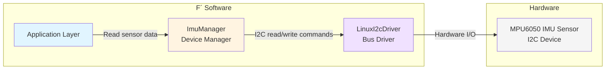

# Develop a Device Driver

This document describes the steps to create a new device manager in F Prime. A device driver is a component that interfaces with hardware peripherals (through a bus driver component). The device driver abstracts provides an interface to manage specific hardware devices.

## Application-Manager-Driver Pattern

A "device driver" traditionally refers to the entire stack of software that manages a hardware device. In F´, the driver-manager pattern splits this in two components: the device manager component and the bus driver component. The bus driver handles the platform-specific implementation of communications on a specific bus (e.g., LinuxI2cDriver, LinuxUartDriver). The device manager handles the operations and logic for a specific device. This enhances modularity and reusability: for example the same device manager can be ported to different platforms by switching the bus driver component.

Please refer to the [Application Manager Driver pattern documentation](../user-manual/design-patterns/app-man-drv.md) for more details on the design pattern used in F Prime for device drivers.

**This guide focuses on the device manager component**. The bus driver component is assumed to already exist, and implementing a bus driver will be covered in a separate guide. Linux implementations are available in core F´ with for example `Drv.LinuxUartDriver`, `Drv.LinuxI2cDriver` and `LinuxSpiDriver`.

### Example and reference

Consider an [MPU6050 IMU sensor](https://cdn-learn.adafruit.com/downloads/pdf/mpu6050-6-axis-accelerometer-and-gyro.pdf) connected via I2C. An example instantiation of the Application-Manager-Driver pattern, defined in the fprime-sensors repository (see [MpuImu component](https://github.com/fprime-community/fprime-sensors/tree/devel/fprime-sensors/MpuImu)), would look like this:
- The bus driver component (LinuxI2cDriver on Linux) handles I2C read and write operations at arbitrary addresses.
- The device manager component (ImuManager) uses the bus driver layer to implement the specific data read/writes sequences that produce relevant data for the MPU6050 sensor, as per its datasheet.
- The application layer uses the device manager component to obtain sensor data when needed.


**Figure**: Application-Manager-Driver pattern example with MPU6050 IMU sensor over I2C.

> [!NOTE]
> The reference MpuImu component linked above is implemented using a state machine to manage the device's initialization and operational modes. This is a design choice for this specific component and **not** a requirement for all device managers. Simpler devices may not need a state machine. Other device manager examples are available in [https://github.com/fprime-community/fprime-sensors/tree/devel/fprime-sensors](https://github.com/fprime-community/fprime-sensors/tree/devel/fprime-sensors).


## How-To Develop a Device Manager

### Step 1 - Understand the Hardware

Before starting development, obtain the datasheet and any relevant documentation for the hardware device. Understand its communication protocol, data formats, and anything relevant to your needs when interfacing with it.

### Step 2 - Define the Device Manager Component

Use `fprime-util new --component` to create a new component for your device manager. This component will translate device-specific operations into bus transactions. Identify the bus type (I2C, SPI, UART, etc.) and the operations needed (read, write, configure, etc.). These should be reflected in the component's ports by mirroring the bus driver's interface.

For our example `ImuManager` component, we are using an I2C bus, therefore we need to define ports that mirror the `Drv.I2c` interface (see [Drv/Interfaces/I2c.fpp](../../Drv/Interfaces/I2c.fpp)). A `Drv.I2c` provides an input port of type `Drv.I2cWriteRead`, so we need to define an output port of that type in our component:

```python
@ Component emitting telemetry read from an MpuImu
active component ImuManager {
    output port busWriteRead: Drv.I2cWriteRead
    output port busWrite: Drv.I2c
}
```

### Step 3 - Implement Device-Specific Behavior

It is good practice to create helper functions for device operations, based on your datasheet. These helpers will then be called from your component's port handlers to respond to requests, or for example update telemetry on a schedule.

```cpp
// ------------- Snippet from Component.hpp -------------
// Register addresses (from datasheet)
static constexpr U8 RESET_REG = 0x00;
static constexpr U8 CONFIG_REG = 0x01;
static constexpr U8 DATA_REG = 0x10;

// Register values
static constexpr U8 RESET_VAL = 0x80;
static constexpr U8 DEFAULT_ADDR = 0x48;
static constexpr U8 DATA_SIZE = 6;

// ------------- Snippet from Component.cpp -------------
// Reset device
Drv::I2cStatus MyDeviceManager::reset() {
    U8 cmd[] = {RESET_REG, RESET_VAL};  // From your datasheet
    Fw::Buffer writeBuffer(cmd, sizeof(cmd));
    return this->busWrite_out(0, m_address, writeBuffer);
}

// Read sensor data
Drv::I2cStatus MyDeviceManager::read(ImuData& output_data) {
    U8 regAddr = DATA_REG;
    U8 rawData[DATA_SIZE];
    Fw::Buffer writeBuffer(&regAddr, 1);
    Fw::Buffer readBuffer(rawData, DATA_SIZE);
    
    Drv::I2cStatus status = this->busWriteRead_out(0, m_address, writeBuffer, readBuffer);
    if (status == Drv::I2cStatus::I2C_OK) {
        // Convert to engineering units - implement as per your datasheet
        output_data = convertRawData(rawData);
    }
    return status;
}
```

> [!TIP]
> The above code snippets are simplified for clarity. In a concrete implementation, these methods and constants would be private members of the component class. Helpers can be broken out in a different file if desired. This is all up to the implementer.

### Step 4 - Expose Behavior to Application layer

Once the device-specific helper functions are implemented, integrate them into your component's behavior. For example, we can configure our ImuManager to:
- a) Emit telemetry on a schedule by connecting to a RateGroup
- b) Expose data to the application layer through additional ports

First, let's represent our ImuData in FPP so we can use it in telemetry and ports:

```python
@ Struct representing X, Y, Z data
struct GeometricVector3 {
    x: F32
    y: F32
    z: F32
}

struct ImuData {
    acceleration: GeometricVector3
    rotation: GeometricVector3
    temperature: F32
}
```

**a) Emit telemetry on a schedule**

Add a run port to connect to a RateGroup, and implement the run handler to read data and emit telemetry on a regular cadence:
```python
active component ImuManager {
    ...

    @ Telemetry channel for IMU data (struct of acceleration, rotation, temperature)
    telemetry ImuData: ImuData
    
    @ Scheduling port for reading from IMU and writing to telemetry
    sync input port run: Svc.Sched

}
```

```cpp
void ImuManager::run_handler(FwIndexType portNum, U32 context) {
    ImuData data;
    Drv::I2cStatus status = this->read(data);
    // Check status and emit telemetry or log error
    if (status == Drv::I2cStatus::I2C_OK) {
        this->tlmWrite_ImuData(data);
    } else {
        this->log_WARNING_HI_ImuReadError(status);
    }
}   
```

**b) Expose data to application layer**

Add a port that returns data on request:

```python
@ Port to read IMU data on request. Update data reference and return status
port ImuDataRead(ref data: ImuData) -> Fw.Success

active component ImuManager {
    ...

    sync input port getData: ImuDataRead
}
```

```cpp
Fw::Success ImuManager::getData_handler(FwIndexType portNum, ImuData& data) {
    Drv::I2cStatus status = this->read(data);
    return (status == Drv::I2cStatus::I2C_OK) ? Fw::SUCCESS : Fw::FAILURE;
}   
```

>[!TIP]
> For more complex use cases, it is recommended not to use Fw.Success but rather define your own status enum to represent different error conditions. Examples are available in the `Drv/` directory in F Prime: [Drv.I2cStatus](https://github.com/nasa/fprime/blob/3f25d8b5358c6a734029e7eeb9dd8621e8895c90/Drv/Ports/I2cDriverPorts.fpp#L14-L21) and [Drv.GpioStatus](https://github.com/nasa/fprime/blob/3f25d8b5358c6a734029e7eeb9dd8621e8895c90/Drv/Ports/GpioDriverPorts.fpp#L2-L7).

### Step 5 - Integrate into Deployment

Wire your device manager to the bus driver in a topology:

```fpp
instance imuManager: MyProject.ImuManager base id 0x1000
instance busDriver: Drv.LinuxI2cDriver base id 0x2000

topology MyTopology {
    connections {
        imuManager.busWriteRead -> busDriver.writeRead
    }
}
```

Then configure the bus driver to open the correct device. This is platform specific. On Linux, this may look like the following:

```cpp
// In Topology.cpp
void configureTopology() {
    ...

    Drv::I2cStatus status = busDriver.open("/dev/i2c-1"); // Or use CLI args
    // TODO: handle status, log if error

    // Optionally, if needed, this is where you would configure the device address
    // This method would need to be implemented in your device manager
    Drv::I2cStatus status = imuManager.configure(0x68); // Device I2C address from datasheet
}
```

> [!TIP]
> A reference MpuImuManager component implementation is available in the fprime-sensors repository: [MpuImu component reference](https://github.com/fprime-community/fprime-sensors/tree/devel/fprime-sensors/MpuImu/Components/ImuManager)

## Best Practices

- Use parameters for configurable device settings (ranges, modes, etc.)
- Always check bus operation status and emit events on errors
- Define all register addresses/values as named constants from the datasheet, don't use "magic" numbers
- Keep device-specific logic in helper functions separate from component infrastructure

## Additional Resources

- [Application Manager Driver Pattern](../user-manual/design-patterns/app-man-drv.md)
- [fprime-sensors Repository](https://github.com/fprime-community/fprime-sensors) - A collection of ready-to-use device managers for specific devices
- [fprime-sensors-reference Repository](https://github.com/fprime-community/fprime-sensors-reference) - Reference project that uses sensors defined in fprime-sensors

