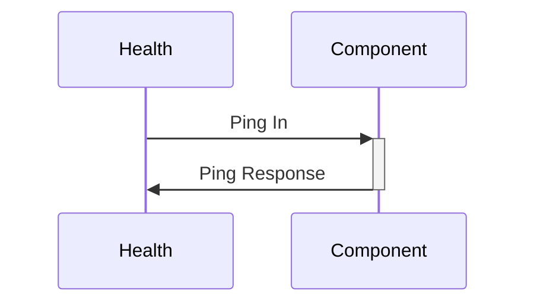

# Health Checking Pattern

Certain services in flight software are critical for the correct execution of the system. For example, command dispatching is crucial to maintain control of the system. It is good practice to monitor these services to ensure they remain responsive during execution of the system. The health checking pattern is used to establish a component as a critical component of the system and periodically check it for responsiveness. 

The fprime-examples repository provides an example of the health checking pattern in its [Manager Component](http://github.com/nasa/fprime-examples/tree/devel/FlightExamples/ManagerWorker) as the Manager is intended to stay responsive at all times.

## Applicability

Any `active` component that must remain responsive for the system's continued functioning should implement the health checking pattern. Such components represent most active components in the system and might include:

  - Command Dispatch
  - Telemetry Handling
  - Event Handling
  - File Management
  - Data Product Management
  - Communications

Additionally, if a component is at-risk for losing responsiveness (e.g. potentially long-running operations, unbounded file i/o, etc.), the health checking pattern can be applied to ensure it remains alive.

## Design

An `active` component needing periodic health-checking should implement a set of [callback ports](./common-port-patterns.md#callback-ports) of type `Svc.Ping` and should be connected to the `Svc.Health` component.  The input `Svc.Ping` port must be asynchronous to ensure the test is run on the component's thread.  Upon receiving a ping, the component responds immediately back with the same message.



`Svc.Health` tracks how long it takes for the component to respond to the ping message placed on its queue.  `Svc.Health` will produce a `WARNING_HI` event after a configurable amount of time followed by `FATAL` event after a longer configured time. Thus the system will issue a WARNING_HI event if a component does not respond, and escalate to a FATAL event (triggering a reset or other FATAL handling) if the component remains unresponsive.

## Implementation

Implementation of the health checking pattern involves placing a pair of `Svc.Ping` ports on your `active` component, one as an `async input` and the other as an `output`.  Typically these ports are named `pingIn` and `pingOut` respectively.

**Component Model Snippet**
```
active component CriticalComponent {
    @ Ping input port to show responsiveness
    async input port pingIn: Svc.Ping

    @ Ping output port for response to the ping
    output port pingOut: Svc.Ping
}
```

The C++ implementation of the component must respond via `pingOut` when handling `pingIn`.

**Component C++ Snippet**
```c++
void CriticalComponent ::pingIn_handler(FwIndexType portNum, U32 key) {
    this->pingOut_out(portNum, key);
}
```

> [!NOTE]
> This implementation of a component's `pingIn_handler` is always the same.  It is safe to copy the above code verbatim as long as `CriticalComponent` is replaced with your component's name.

At the system topology level, you must specify a component handling system health.

```
topology MyTopology {
    ...
    health connections instance $health # Use instance 'health' as the handler of health (Svc.Ping) connections
}
```

You must also configure the delays (measured in the Health component's [rate group](./rate-group.md) ticks) that invoke a warning and fatal response from `Svc.Health`. This is done by defining a component instance configuration block in the `PingEntries` namespace under your topology's namespace

```c++
namespace MyTopology {
    namespace PingEntries {
        // Health 
        namespace criticalComponent {
            enum {
                WARN = 3, // WARNING_HI after 3 ticks without a response from criticalComponent instance of CriticalComponent
                FATAL = 5 // FATAL after 5 ticks without a response  from criticalComponent instance of CriticalComponent
            };
        }
    }
}
```
> [!NOTE]
> This configuration is set for **each instance** of the component.  In this example `criticalComponent` is an instance of `CriticalComponent`

## Testing and Verification

The health checking pattern can be tested by a combination of unit and integration tests. For basic functionality, invoke the `input` Svc.Ping port in a unit test, dispatch the component, and assert the `output` Svc.Ping port returned the supplied key.

Integration tests can be used to test this pattern alongside the Svc.Health component. Set the ping timeout of the component below the minimum time for the component using `HLTH_CHNG_PING` and assert that appropriate WARNING and/or FATAL events occur.

## Other Considerations

The health checking pattern can be used to test any active component, not just critical ones.  However, care should be taken with configured values as Svc.Health will FATAL the system in response to unresponsive components leading to system reset or other FATAL handling actions.

## Conclusion

The health checking pattern can be used to ensure critical services within the system remain responsive over the course of the software's execution. Should the component fail to respond for a pair of configurable durations, a WARNING_HI and FATAL event will respectively result.
