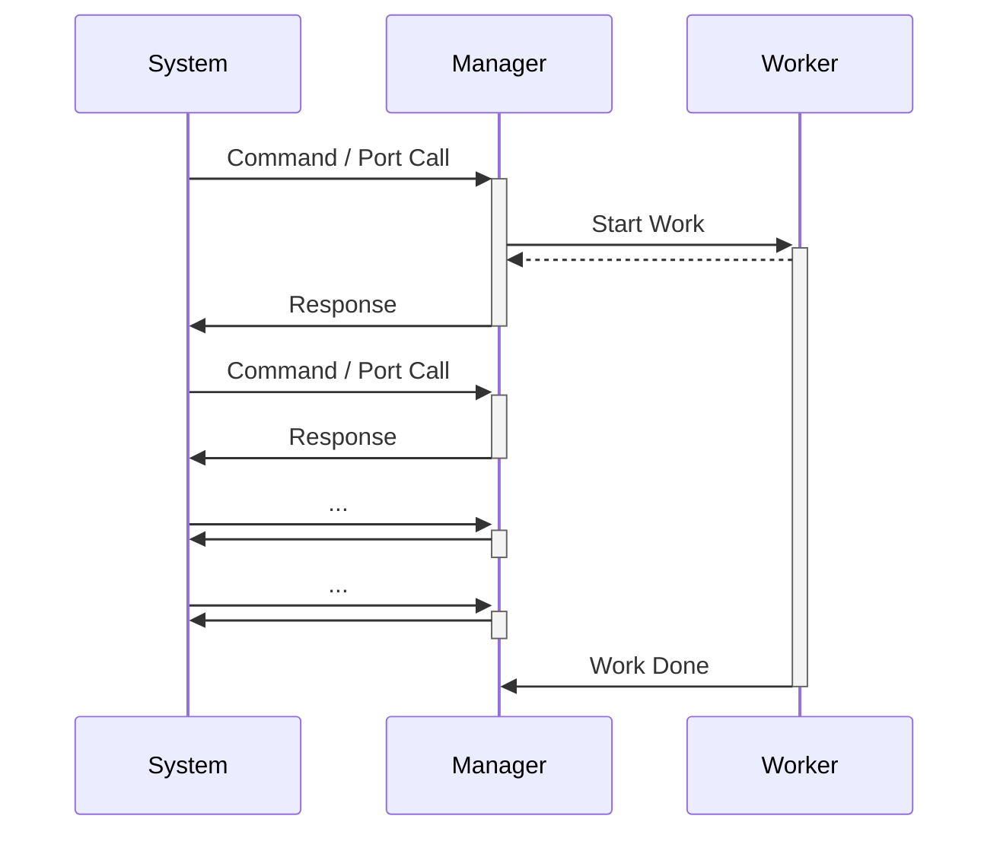

# The Manager/Worker Pattern

The manager/worker pattern is used to perform long-running background work within a component that needs to remain highly responsive to the rest of the system. It is an adoption of the "worker thread" pattern (commonly seen in Computer Science) into the F Prime architecture.

The fprime-examples repository provides an example of the [Manager/Worker Pattern](http://github.com/nasa/fprime-examples/tree/devel/FlightExamples/ManagerWorker).

## Applicability

Often a component needs to perform some long-running work while still remaining responsive to commands and port dispatches coming in from the rest of the system. A few examples of such work are:

  - File Operations 
  - Algorithms with Long Compute Time
  - Machine Learning

Any work that is long enough to lock-up a component when it should be responsive to the larger system can be considered for this pattern.

You may also determine that some work of a component needs to be high-priority (e.g. responding to commands) and other work of that same component needs to be low-priority (e.g. loading a large file in the background).  This is another clear indication that you should consider the manager/worker pattern.


## Design

The manager/worker pattern is composed of two separate components: an `active` worker set to a low-priority that performs background work, and a manager component that off-loads background work to that worker. The worker component performs a [callback](./common-port-patterns.md#callback-ports) when the work is finished. This callback often contains the status of the work (complete, canceled, errored, etc). You could add in additional statuses if you wish to indicate work that is partially done (50% complete, on step 3, etc).



All interactions with the worker should be through the Manager in order to ensure that the worker need not be responsive while working.

The worker must be asynchronous in order to free up the manager's execution context.  Typically the worker is set to a lower priority in the system topology to ensure that its background work does not disrupt higher-priority work in a real-time operating system.

## Implementation

The implementation of the manager/worker pattern starts with two `active` components. A set of [callback ports](./common-port-patterns.md#callback-ports) is used for the manager to dispatch work to the worker and receive status in response. 

**Manager Model Snippet**
```
active component Manager {
    ...

    @ Signal to start the worker
    output port startWorker: Fw.Signal

    @ Signal from the worker that the work is finished
    async input port doneRecv: Fw.CompletionStatus

    @ Event to indicate that the work is starting
    event StartWork() severity activity high format "Manager starting work"

    @ Event to indicate that work is already happening
    event WorkerBusy() severity warning high format "Worker is currently busy"

    ...
}
```
> [!NOTE]
> Any port types can be used to start work and signal completion as long as the worker component matches.

> [!NOTE]
> The manager component typically has commands, port calls, and other design elements. This above snippet just represents the interaction with the worker.

**Manager Implementation Snippet**
```
void Manager ::START_cmdHandler(FwOpcodeType opCode, U32 cmdSeq) {
    if (this->m_busy) {
        this->log_ACTIVITY_HI_WorkerBusy();
    } else {
        this->m_busy = true;
        this->log_ACTIVITY_HI_StartWork();
        this->startWorker_out(0);
    }
    this->cmdResponse_out(opCode, cmdSeq, Fw::CmdResponse::OK);
}

void Manager ::doneRecv_handler(FwIndexType port, const Fw::Completed& status) {
    this->m_busy = false;
    ... handle status of work ...
}
```
Here the manager responds to a command by delegating work to the worker, and then returning a command status.

**Worker Model Snippet**
```
active component Worker {
    @ Signal to start the work
    async input port start: Fw.Signal

    @ Signal that the work is done
    output port workDone: Fw.CompletionStatus
}
```

> [!NOTE]
> Workers typically have no inputs (commands, ports) except those that are controlled by the manager component.

**Worker Implementation Snippet**
```
void Worker ::start_handler(FwIndexType port) {
    ... do work ...
    this->workDone_out(0, Fw::Completed::COMPLETED);
}
```


The [synchronous cancel port](./common-port-patterns.md#synchronous-cancel) pattern can be applied to the manager and worker components should the worker need to support the ability to cancel ongoing work.

There is one critical aspect of the manager/worker pattern that is set up at the system topology level: priority of the manager and worker.  Managers are by definition responsive, and thus run at a high-priority. Workers are typically background tasks, and thus run at a low-priority.

**Manager/Worker Instance Priorities**
```
instance manager: Manager base id Manage 0x0000 \
    queue size ... \
    stack size ... \
    priority 90 # High-priority (Linux) for the Manager

instance worker: ManagerWorker.Worker base id 0x1000 \
    queue size ... \
    stack size ... \
    priority 20 # Low-priority (Linux) for the Worker
```

> [!NOTE]
> Actual priorities should be determined relative to the other instances in the system. 

## Testing and Verification

Standard F Prime [Unit Testing](../overview/unit-testing.md) can be applied to test each component individually. However, this pattern typically requires integration testing to ensure that the manager/worker perform in-unison.

** Manager Response Testing **
```
def test_manager_response(fprime_test_api):
    """ Test that the manager remains responsive during work"""
    fprime_test_api.send_and_assert_command("manager.START", events=["manager.StartWork"])
    fprime_test_api.send_and_assert_command("manager.START", events=["manager.WorkerBusy"])
```

This simple test tries to start the manager twice and ensure it is up and responsive by looking for a manager busy `manager.WorkerBusy` event.  A more complete test is shown in the provided example.

## Other Considerations

There are other things that may be considered as part of this pattern.

### Manager Command Completion

Some implementations of the manager will respond with command complete calls immediately on receipt of a command. This unblocks waiting command sequencers to continue executing commands. However, it does not accurately represent that the work itself has been done.  

You may prefer to store the command completion parameters and respond with command complete calls on the work done handler in the manager instead. This will ensure an accurate reflection of the work getting done, but will also block command sequencers from progressing while the work is done.

Your specific manager will need to choose which path is right for your system.  Here are a few hints to help you decide:

1. Do you need to directly perform an action once the work is completed? If so, store the command response and respond later.
2. Do you want a blocking sequencer to continue while the work is performed? If so, respond immediately.

> [!NOTE]
> This pattern is about responsiveness of system components. Responding to commands later does not affect responsiveness but will prevent sequencing from continuing when running in BLOCK mode.

### Multiple Requests

Typically the manager/worker pattern is set up such that a worker will only perform one job at a time. The manager component will typically respond to additional requests with one of the following responses:

1. Respond with a busy event
2. Queue the request
3. Dispatching to a worker pool 

Busy events are most common and are used for the case when only a single worker request makes sense at a time. File loading workers often respond with busy.

Queuing requests can be done when all requests must eventually happen, but timeliness is not an issue. The manager should use a separate queue from the command queue when queueing future work requests.

Dispatching to a worker pool is used when more work needs to get done than a single worker can handle and the system needs to take advantage of parallelism.  This work is typically of medium-priority since timeliness is desired, and worker-pool workers are typically placed at a higher priority than their background worker counterparts.

## Conclusion

The manager/worker pattern can be used to off-load background work from a highly-responsive component to a low-priority worker. The worker then reports when the task is done thus ensuring the manager can remain responsive to requests during the duration of the work performed.
