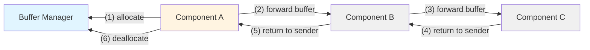

# Buffer Pools with Svc.BufferManager

In embedded systems, dynamic memory allocation (a.k.a heap allocation) is typically avoided to reduce the steady-state
variability in a running system. Avoiding dynamic memory allocation also avoids the problem of what to do in the case of
a failed allocation. However, sometimes dynamic allocation is required for a more robust or efficient solution.

Safe dynamic allocation is available using the buffer pool pattern in F´, implemented through the [`Svc::BufferManager`](../../../../Svc/BufferManager/docs/sdd.md) component. In short, this pattern allows components to
dynamically allocate memory through a port call to a component designed to manage memory for the system. There are three steps in this process:

1. Call allocation port receiving an `Fw::Buffer`
2. Check validity of the buffer with `buffer.isValid()` and handle potential allocation failure
3. Use the allocated `Fw::Buffer`
4. Call deallocation port returning the `Fw::Buffer`

## Component Setup and Buffer Usage

This section will describe the work done within a component to allocate, use, and deallocate buffers. 

## Allocating and Deallocating `Fw::Buffer`s

Allocation and deallocation are done through port calls to a buffer managing component. The component needing dynamic
memory allocation should include two output ports:

1. Output port of type `Fw::BufferGet` to request a buffer
2. Output port of type `Fw::BufferSend` to deallocate the requested buffer.

This can be done by importing the `Svc.BufferAllocation` FPP interface in the component's FPP definition file as shown in the examples below.

In the case that allocation fails, the `Fw::Buffer` return from the `Fw::BufferGet` port will be marked invalid and have a size of zero.
This must be checked using the `Fw::Buffer::isValid()` method.
Developers must check that the size is not smaller than requested before proceeding to use the memory.

**Example Component Definition**

```python
passive component MyComponent {
    @ Add allocation and deallocation output ports for interfacing with a BufferManager
    import Svc.BufferAllocation

    @ Allocation failed event
    event MemoryAllocationFailed() severity warning low id 0 format "Failed to allocate memory"
}
```

> [!TIP]
> You can inspect the ports defined by the `Svc.BufferAllocation` interface in [Svc/Interfaces/BufferAllocation.fpp](../../../../Svc/Interfaces/BufferAllocation.fpp).

**Example Component Allocation and Deallocation**
```c++
    ...
    const U32 needed_size = 1024;
    Fw::Buffer my_buffer = this->allocate_out(0, needed_size);
    
    if (my_buffer.getSize() < needed_size) {
        this->deallocate_out(0, my_buffer);
        this->log_WARNING_LO_MemoryAllocationFailed();
    } else {
        ...
        ...
        this->deallocate_out(0, my_buffer);
    }
```

### Working With F´ Buffers

`Fw::Buffer` objects function as a wrapper for generic memory regions. They consist of a pointer to memory and the 
size of the memory region pointed to by the pointer. An easy way to work with an `Fw::Buffer` is to use the 
serialization representation of the buffer. 

To use this method, get either a serializer or deserializer using the `Fw::Buffer.getSerializer()` 
or `Fw::Buffer.getDeserializer()` methods. Both of these methods return a `Fw::ExternalSerializeBufferWithMemberCopy` 
object which you can then call `.serializeFrom()` or `.deserializeTo()` on. This object implements the
`Fw::SerialBufferBase` interface, so it can also be passed directly to `Fw::Serializable::serializeTo` and
`Fw::Serializable::deserializeFrom` methods.

**Example Using Serialization and Deserialization Methods**

```c++
U32 my_value = 123;
Fw::Buffer my_buffer = ...;
// Serializes my_value into my_buffer - defaults to big-endian
my_buffer.getSerializer().serializeFrom(mv_value);
// Or for little-endian
my_buffer.getSerializer().serializeFrom(mv_value, Fw::Endianness::LITTLE);

U32 my_value_again = 0;
// Deserializes my_buffer into my_value_again - defaults to big-endian
my_buffer.getDeserializer().deserializeTo(mv_value_again);
// Or for little-endian
my_buffer.getDeserializer().deserializeTo(mv_value_again, Fw::Endianness::LITTLE);
```

> [!NOTE]
> To use this method types must inherit from `Fw::Serializable` or be basic types. U32 is a basic type.

Users can access the `Fw::Buffer`'s data directly using `Fw::Buffer.getData()`, which will return a `U8*` pointer to the
buffer's memory. Care should be taken as this is a raw pointer and thus buffer overruns are possible.

**Example Using Raw Data**

```c++
Fw::Buffer my_buffer = ...;
U8* const data = my_buffer.getData();

FW_ASSERT(my_buffer.getSize() >= 4); // Prevent overrun on next line
data[3] = 1;
```

Full [`Fw::Buffer` documentation is available](../../../reference/api/cpp/html/class_fw_1_1_buffer.html).


## Topology Consideration

There are several components designed to allow for memory allocation and they differ in terms of complexity and use
cases. They both support the `Fw::BufferGet` and `Fw::BufferSend` port interface for allocation and deallocation and
thus can be used interchangeably subject to the descriptions in this section.

Each section will describe any special setup needed in the topology and how to hook up the manager's ports.

### Svc.BufferManager

Svc.BufferManager uses multiple bins of memory with fixed-size sub-allocations within a bin. It has a single allocate
and deallocate port that may take any size allocation request. Svc.BufferManager searches all bins with sub-allocation
size larger than the request for an available buffer, which it then marks as used and returns.

There is no restriction on the ordering of calls for allocation and deallocation. Clients may have multiple outstanding allocations and thus asynchronous usage of these allocations is supported.

For more details, see the [Svc.BufferManager SDD](../../../../Svc/BufferManager/docs/sdd.md).

**When To Use Svc.BufferManager**

Svc.BufferManager must be used when asynchronous handling of memory is needed or sharing of memory is desired. It can
be used generically but comes at the cost of complexity of implementation and setup.

**Usage Requirements**

Allocating more memory than available will result in buffers with size 0 being returned and is not an error. However,
buffers must be allocated and returned using the same instance of Svc.BufferManager. 

Buffer manager will assert under the following conditions:
1. A returned buffer has the incorrect manager ID (returned to the wrong instance).
2. A returned buffer has an incorrect buffer ID (invalid buffer returned).
3. A returned buffer is returned with a correct buffer ID but hasn't already been allocated.
4. A returned buffer has an indicated size larger than originally allocated.
5. A returned buffer has a pointer outside the region originally allocated.

**Connections**

All connections to Svc.BufferManager can be done using the single pair of allocate and deallocate ports. This is shown
in the following snippet of a topology:

```fpp
      client1.allocate -> my_buffer_manager.bufferGetCallee
      client1.deallocate -> my_buffer_manager.bufferSendIn
      
      client2.allocate -> my_buffer_manager.bufferGetCallee
      client2.deallocate -> my_buffer_manager.bufferSendIn
```

The buffer manager should also be hooked up to a rate group used to downlink telemetry and it requires standard
telemetry, events, and time connections.

**Configuration and Setup**

The number of sub allocations is configured in the `BufferManagerComponentImplCfg.hpp` header using the 
`BUFFERMGR_MAX_NUM_BINS` value.

When using Svc.BufferManager the `Svc::BufferManagerComponentImpl.setup()` method must be called supplying a U16 manager
ID, a buffer id, an implementation of [Fw::MemAllocator](../../../reference/api/cpp/html/class_fw_1_1_mem_allocator.html) used to
allocate memory for the sub-allocations, and a
[Svc::BufferManagerComponentImpl::BufferBins](../../../reference/api/cpp/html/struct_svc_1_1_buffer_manager_component_impl_1_1_buffer_bin.html)
struct configuring the sub allocations.

The Svc::BufferManagerComponentImpl::BufferBins is a table specifying N buffers of M size per bin. Up to MAX_NUM_BINS
bins can be specified. The table is copied when setup() is called, so it does not need to be retained after the call.

The rules for specifying bins:
1. For each bin (BufferBins.bins[n]), specify the size of the buffers (bufferSize) in the bin and how many buffers for
   that bin (numBuffers).
2. The bins must be ordered based on an increasing bufferSize to allow BufferManager to search for available buffers.
   When receiving a request for a buffer, the component will search for the first buffer from the bins that are equal to
   or greater than the requested size, starting at the beginning of the table.
3. Any unused bins should have numBuffers set to 0.
4. A single bin can be specified if a single size is needed. 
   
> [!NOTE]
> a pointer to the Fw::MemAllocator used in setup() is stored for later memory cleanup. The instance of the allocator must persist beyond calling the cleanup() function or the destructor of BufferManager if cleanup() is not called. If a project-specific manual memory allocator is not needed, Fw::MallocAllocator can be used to supply heap allocated memory.

**Example Setup of Svc.BufferManager in a Topology.cpp**
```c++
Fw::MallocAllocator allocator;
Svc::BufferManagerComponentImpl my_buffer_manager;

...
{
    Svc::BufferManager::BufferBins my_bins;
    memset(&my_bins, 0, sizeof(my_bins)); // All non-specified bins are zero

    my_bins.bins[0].bufferSize = 1024; // Buffers in bin 0 are of size 1024
    my_bins.bins[0].numBuffers = 2; // Two buffers of size 1024 are available in bin 0
    my_bins.bins[1].bufferSize = 10240; // Buffers in bin 1 are of size 10240
    my_bins.bins[1].numBuffers = 1; // One buffers of size 10240 are available in bin 1
    
    my_buffer_manager.setup(123, 0, allocator, my_bins);
}

...
{
    my_buffer_manager.cleanup();
}
```

**Rules of Thumb for Bin Sizes**

Buffers bins should be tailored based on expected usage. If many small requests are expected, then set up a large number of smaller bins. If larger allocations are expected, set bins of that size.

The above trivial example allows for a few small allocations and one large allocation. In this case, there is a risk that the large allocation is used for the small allocation use case and thus care should be taken to ensure that the smaller use
cases have a sufficient number of buffers to prevent stealing of larger allocations.

## Deallocation strategy

`Fw::Buffer`s **must** eventually be returned to the same instance that allocated them.

Additionally, it is a recommended practice to deallocate a buffer in the same component where it was allocated. This is accomplished using the buffer ownership "Return-To-Sender" pattern described below.

### Design Pattern: Return-To-Sender

In situations where a component allocates a buffer but cannot deallocate it directly (for example, when the buffer is sent asynchronously to another component), a common pattern is the buffer "return-to-sender" design pattern.

Each component returns the received buffer to its immediate sender, creating an "unwrapping" effect where buffers flow forward through the processing chain and return backward step-by-step until reaching the original allocator.



This pattern enhances modularity and prevent breaking encapsulation by making topology connections agnostic to the underlying buffer management strategy of each component.  
Let's unwrap this statement by considering the alternative to the Return-To-Sender pattern, where Component C returns the buffer directly to the Buffer Manager, bypassing B and A on the way back. In this case, let's consider the scenario where Component B needs to append to the buffer (this can happen for example during framing operations, where the buffer grows in size). To enable that, Component B allocates a new larger buffer, and the topology connections would have to be redrawn, carefully tracking the lifetime of two allocated buffers.  
With the Return-To-Sender pattern, Component B can handle the lifetime of each buffers internally: it allocates a new larger buffer to send down the chain (and expects it to come back), and returns the smaller buffer directly to its sender. This does not affect the broader topology, and the extra memory management is isolated to Component B. 

An example of this pattern can be found in the [`Svc.ComFprime`](../../../../Svc/Subtopologies/ComFprime/docs/sdd.md) and [`Svc.ComCcsds`](../../../../Svc/Subtopologies/ComCcsds/docs/sdd.md) subtopologies, in the `connections Uplink` blocks.
